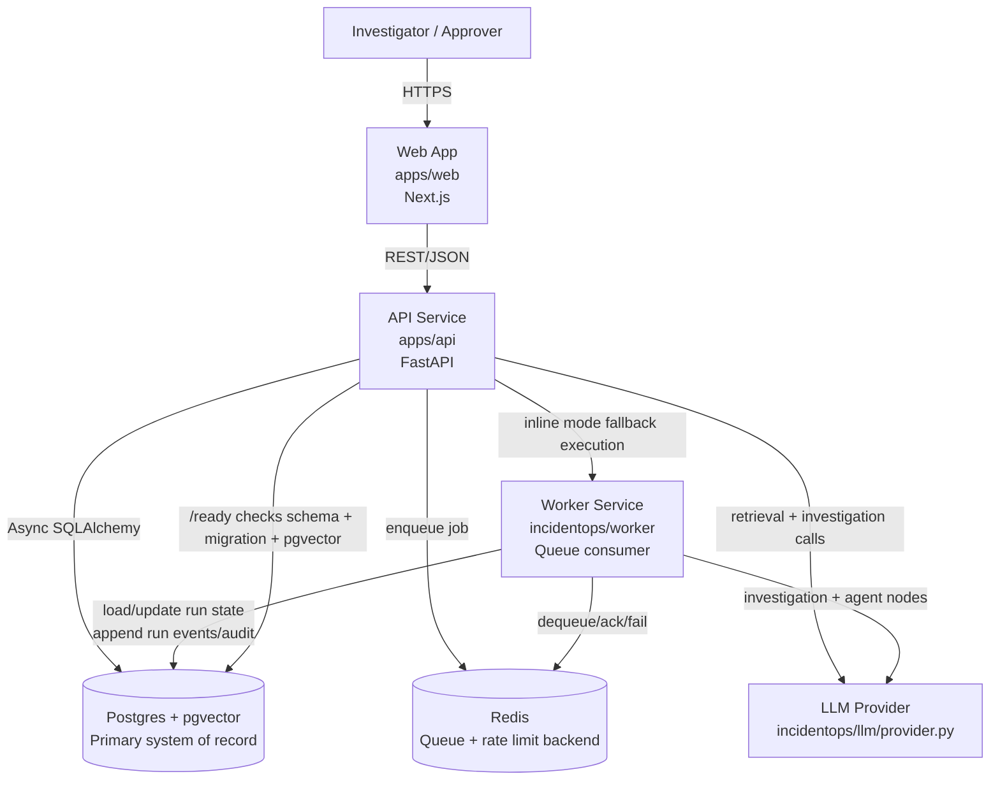

# Architecture

IncidentOps Agent is split into ingestion, retrieval, investigation, agent workflow, security, evals, observability, and frontend surfaces. Retrieval stays deterministic and metadata-driven. Investigation turns evidence into timelines and hypotheses. The run workflow persists progress and approvals for inspectability.

Production runtime separates API request handling from long-running work:

```text
API request
  -> validate auth/RBAC/limits
  -> create persisted run/eval record
  -> enqueue job
  -> return run_id/eval_run_id

Worker
  -> dequeue job
  -> execute workflow/eval
  -> persist events/status/results
  -> record audit and metrics
```

Local development can run inline execution for fast smoke tests. Staging and production should use `WORKER_MODE=queue` with `JOB_QUEUE_BACKEND=redis`.

Workflow execution is deterministic: the worker orchestrates existing classifier, entity extraction, retrieval, analyzers, hypothesis selection, report draft, issue draft, and approval gate nodes. Nodes emit persisted start/completion/failure/retry events and are bounded by configurable timeout and retry settings.

## Container View (C4 style)



## Data Flow by Capability

### Ingestion (`incidentops/ingestion/*`)

- **Primary modules**: `incidentops/ingestion/pipeline.py`, `incidentops/ingestion/parsers/*`, `incidentops/ingestion/chunking/chunker.py`, `incidentops/ingestion/indexer.py`.
- **Schema references (I/O)**:
  - Input request and limits are validated in API schemas/routes (`incidentops/schemas/api.py`, `apps/api/routes/ingest.py`).
  - Normalized domain objects and parser/chunk outputs are represented in `incidentops/ingestion/schemas.py` and `incidentops/ingestion/normalized.py`.
- **Persistence touchpoints**:
  - Writes `Source`, `Document`, and `Chunk` records through repository helpers in `incidentops/db/repositories.py`.
  - Core table definitions live in `incidentops/db/models.py`.
- **Determinism / retry / timeout**:
  - Parser/chunker/indexer flow is deterministic for the same input bytes + metadata (no stochastic model calls in core ingestion transforms).
  - In queue mode, ingestion-triggered async follow-ups inherit worker-level failure capture (`queue.fail`) and observability counters.
  - Request-level limits (document bytes, chunk/token limits) are hard-bounded by settings in `incidentops/config/settings.py`; malformed payloads should fail fast at validation/parse boundaries.

### Retrieval (`incidentops/retrieval/*`)

- **Primary modules**: `embeddings.py`, `vector_search.py`, `lexical_search.py`, `hybrid_search.py`, `reranker.py`, `citation_builder.py`, `evidence_packer.py`.
- **Schema references (I/O)**:
  - Retrieval request contracts are expressed in API schemas (`incidentops/schemas/api.py`) and investigation service calls.
  - Evidence/citation payloads are normalized into response structures used by investigate/run APIs.
- **Persistence touchpoints**:
  - Reads `Chunk`/`Document` corpus from Postgres + pgvector via repository search functions (`vector_search`, `lexical_search`).
  - Logs retrieval traces via `log_retrieval_run` into `RetrievalRun` and `RetrievalResult` (`incidentops/db/repositories.py`, models in `incidentops/db/models.py`).
- **Determinism / retry / timeout**:
  - Hybrid ranking is designed to be deterministic for a fixed corpus/version, configured weights, and embedding output.
  - External variance can enter from embedding/reranker providers; fallback behavior should still produce bounded top-k outputs.
  - Top-k and context-size constraints are bounded by settings (`default_top_k`, `max_top_k`, `max_context_tokens`).

### Investigation (`incidentops/investigation/*`)

- **Primary modules**: `service.py`, `classifier.py`, `entity_extractor.py`, `scope_resolver.py`, `log_analyzer.py`, `deploy_analyzer.py`, `incident_matcher.py`, `hypothesis_generator.py`, `root_cause_selector.py`, `timeline_builder.py`.
- **Schema references (I/O)**:
  - Input query/top-k/debug contract: `InvestigationRequest` (`incidentops/schemas/api.py`).
  - Output contract: `InvestigationResponse` (+ entity/timeline/hypothesis/root-cause nested schemas) in `incidentops/schemas/api.py` and `incidentops/investigation/schemas.py`.
- **Persistence touchpoints**:
  - Investigation endpoint logs audit events (`record_audit_event`) and retrieval logging persists ranking artifacts.
  - Read path depends on retrieval corpus tables and retrieval-run logging tables in `incidentops/db/models.py`.
- **Determinism / retry / timeout**:
  - The orchestration order in `investigation/service.py` is fixed.
  - Determinism is strongest when LLM-backed components are disabled/replaced; with live LLM calls, outputs may vary, but control flow remains deterministic.
  - Request processing is bounded by API limits and upstream provider timeout (`llm_timeout_seconds`).

### Agent workflow (`incidentops/agent/*`)

- **Primary modules**: `service.py`, `graph.py`, `nodes.py`, `state.py`, `events.py`, `tools.py`.
- **Schema references (I/O)**:
  - Run creation/status/approval API contracts in `incidentops/schemas/api.py` (`RunCreateRequest`, `RunResponse`, `RunEventResponse`, approval schemas).
  - Queue job payload schema in `incidentops/worker/schemas.py` (`Job`).
  - In-memory workflow state shape in `incidentops/agent/state.py`.
- **Persistence touchpoints**:
  - Writes/updates `AgentRun`, `AgentRunEvent`, `Approval`, `IncidentReportDraft`, `IssueDraft` through service/event helpers and SQLAlchemy sessions.
  - Queue-mode run scheduling uses `apps/api/routes/runs.py` + queue backend (`incidentops/worker/queue.py`); execution commits are performed in worker job handlers.
- **Determinism / retry / timeout**:
  - Node order is fixed by `NODE_ORDER` in `incidentops/agent/graph.py`.
  - Each node emits `node_started/node_completed/node_failed/node_retried` events for inspectable replay in `AgentRunEvent`.
  - Per-node timeout: `workflow_node_timeout_seconds`; run timeout: `workflow_run_timeout_seconds`; retries: `workflow_max_retries` with `wait_for_human_approval` marked non-retryable.
  - Worker catches unhandled exceptions, pushes failed jobs to backend-specific failure storage, and increments job failure metrics.

## Failure Modes and Recovery

| Failure mode | Detection signal | Operator action |
|---|---|---|
| Queue outage (Redis unavailable / enqueue failure) | `POST /v1/runs` returns 503 on enqueue failure; audit event `workflow_job_failed`; worker/job counters indicate enqueue/drop anomalies. | Verify Redis health/connectivity (`REDIS_URL`), restore service, re-submit failed runs (or implement replay from failed queue entries). |
| DB migration drift | `/ready` returns 503 with `migration=outdated|missing`, includes `current_revision` and `head_revision`; readiness payload also flags missing required tables/pgvector. | Run migrations to head, confirm `alembic_version`, re-check `/ready`, and block deploy traffic until ready. |
| LLM timeout | Node failure events include timeout error; run status moves to `failed` after retry exhaustion; `workflow_node_failures_total` and run error fields increase. | Increase provider reliability or timeout budget (`llm_timeout_seconds`, node timeout), retry run, and review provider latency/SLA. |
| Malformed ingest document | Validation/parsing errors during ingest; audit failure records and request errors surface immediately; no successful chunk persistence for that document. | Quarantine offending input, correct source format/encoding/metadata, re-run ingestion, and monitor parser diagnostics. |
| Approval gate timeout / stalled pending approval | Run remains `awaiting_approval` with pending `Approval` row and no `approval_resolved` event; event stream shows progression halted at approval node. | Review approval queue, approve/reject via `/v1/runs/{run_id}/approve|reject`, and enforce operational SLA/escalation for aging approvals. |

## End-to-end Sequence: Investigate request in queue mode

```mermaid
sequenceDiagram
  autonumber
  participant U as Client/User
  participant API as API (apps/api/routes/runs.py)
  participant DB as Postgres + pgvector
  participant Q as Redis Queue
  participant W as Worker (incidentops/worker/main.py)
  participant A as Agent Service (incidentops/agent/service.py)
  participant L as LLM Provider

  U->>API: POST /v1/runs {project_id, query, top_k}
  API->>API: auth/RBAC/rate-limit/query validation
  API->>DB: create AgentRun(status=queued)
  API->>DB: append run_created + job_enqueued events
  API->>DB: commit transaction
  API->>Q: enqueue execute_workflow_run(job payload)
  API-->>U: 200 RunResponse {run_id,status=queued}

  W->>Q: dequeue job
  W->>DB: load AgentRun by run_id
  W->>DB: audit workflow_job_started
  W->>A: execute_run(run, top_k, reranker)
  A->>DB: set run status=running; append run_started
  A->>DB: retrieval reads chunks/docs + logs retrieval run
  A->>L: investigation/agent model calls (bounded timeouts)
  A->>DB: append node_started/completed/failed(/retried) events
  A->>DB: persist final state, answer, drafts/approval
  A->>DB: append run_finished (or run_failed)
  W->>DB: audit workflow_job_completed/failed + commit
  W->>Q: acknowledge job (or fail queue entry)
```
