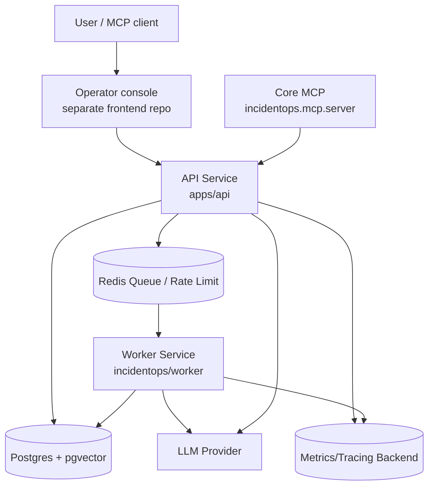
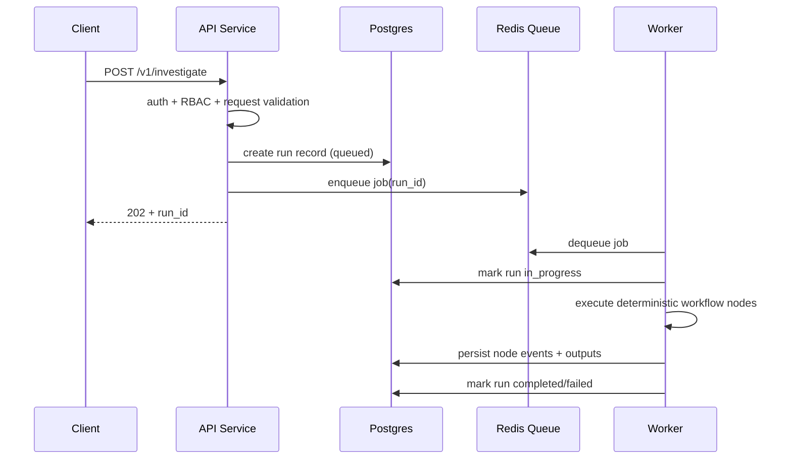

# Architecture

> Back to docs index: [docs/README.md](./README.md)

IncidentOps Core is split into ingestion, retrieval, investigation, workflow runtime, security, evals, observability, and operator-facing API surfaces. Retrieval stays metadata-driven and deterministic where possible. Investigation turns evidence into timelines and hypotheses. Workflow state persists progress and approvals for inspectability.

## Container View (C4-style)



## Runtime Split

Production runtime separates API request handling from long-running work:

```text
API request
  -> validate auth/RBAC/limits
  -> create persisted run/eval record
  -> enqueue job
  -> return run_id/eval_run_id

Worker
  -> dequeue job
  -> execute workflow/eval
  -> persist events/status/results
  -> record audit and metrics
```

Local development can run inline execution for fast smoke tests. Staging and production should use `WORKER_MODE=queue` with `JOB_QUEUE_BACKEND=redis`.

## Capability Data Flows

### 1) Ingestion

- Input: source/collector/sync or local ingest payload.
- Key modules: `incidentops/ingestion/pipeline.py`, parsers under `incidentops/ingestion/parsers/`, chunking under `incidentops/ingestion/chunking/`.
- Persistence: normalized/chunked records and embeddings persisted through DB models/repositories.
- Output: searchable evidence chunks with metadata and redaction-safe diagnostics.

### 2) Retrieval

- Input: user query + project scope.
- Key modules: `incidentops/retrieval/query_intent.py`, `hybrid_search.py`, `vector_search.py`, `lexical_search.py`, `reranker.py`, `evidence_packer.py`, `citation_builder.py`.
- Persistence touchpoints: vector/metadata lookup over evidence corpus in Postgres/pgvector.
- Output: intent-aware ranked evidence pack plus retrieval diagnostics and citation artifacts.

### 3) Investigation

- Input: investigation request + evidence candidates.
- Key modules: `incidentops/investigation/service.py`, timeline/classifier/analyzer modules.
- Persistence: investigation run state, timeline artifacts, and outputs.
- Output: timeline, hypotheses, likely root-cause candidates.

Simple code/config/API lookups can bypass heavy synthesis and return direct-evidence answers with citations. Runtime RCA questions stay cautious when logs, deploys, or incident history are missing.

### 4) Agent Workflow

- Input: workflow run request.
- Key modules: `incidentops/agent/graph.py`, `nodes.py`, `state.py`, `service.py`, `events.py`.
- Behavior: deterministic node orchestration over existing classifiers/retrieval/analyzers.
- Persistence: node lifecycle events (`start/completion/failure/retry`), status, approvals, final report.

Workflow execution is bounded by node timeout/retry and run-level timeout settings.

## Current query and answer flow

```text
query
  -> query intent classification
  -> retrieval budget selection
  -> lexical + vector + metadata retrieval
  -> score fusion, boosts, penalties
  -> compact evidence packing
  -> direct evidence fast path or Azure OpenAI synthesis
```

Current runtime diagnostics expose:

- `query_intent`
- `retrieval_budget`
- `source_type_distribution`
- `chunk_type_distribution`
- `applied_boosts`
- `applied_penalties`
- `retrieval_branch_latencies`
- `total_retrieval_latency_ms`

## End-to-End Sequence (Queue Mode Investigation)



## Failure Modes and Recovery

| Failure mode | Detection signal | Typical impact | Recovery action |
|---|---|---|---|
| Redis queue unavailable | queue enqueue/dequeue failures, run backlog | new runs remain queued or fail to enqueue | restore Redis connectivity, restart workers if needed, replay queued runs |
| DB migration drift | `/ready` fails migration check | API not production-ready | run `alembic upgrade head`, verify `python scripts/check_migrations.py` |
| LLM timeout | workflow node timeout events, increased run latency | partial/failed report generation | tune node/run timeout, retry policy, provider connectivity |
| Azure OpenAI embedding throttling | repeated `429` or retryable embedding failures | slow or failed indexing / retrieval embedding path | backoff/retry, reduce burst size, move embedding work off the request event loop |
| Collector batch upload throttling | `429` on `/v1/sources/{source_id}/documents/batch` | normalized docs never reach Core, zero chunks created | keep collector-specific batch limit separate from human request throttles |
| Malformed ingest document | per-document ingest errors | partial ingestion | fix offending document/metadata, re-submit batch |
| Approval gate stall | run remains awaiting approval beyond SLA | delayed incident closure | review pending approvals, approve/reject to unblock run |
