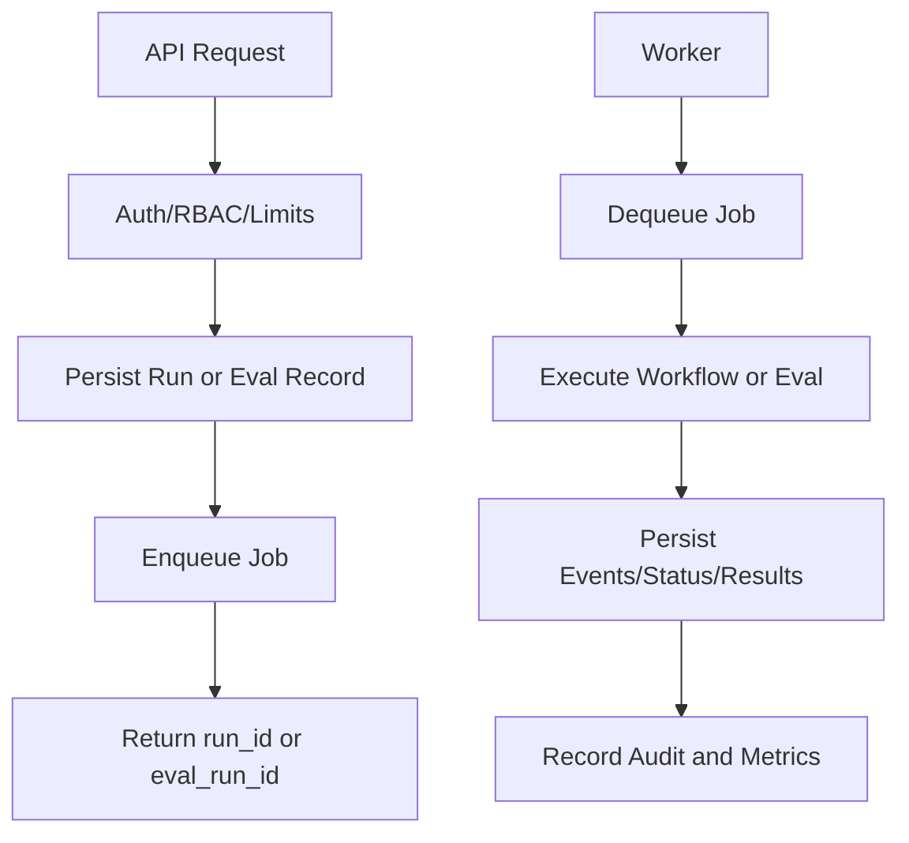

# Architecture · [Docs Hub](./README.md)

IncidentOps Agent is split into ingestion, retrieval, investigation, agent workflow, security, evals, observability, and frontend surfaces. Retrieval stays deterministic and metadata-driven. Investigation turns evidence into timelines and hypotheses. The run workflow persists progress and approvals for inspectability.

## Runtime Flow Diagram



Production runtime separates API request handling from long-running work:

```text
API request
  -> validate auth/RBAC/limits
  -> create persisted run/eval record
  -> enqueue job
  -> return run_id/eval_run_id

Worker
  -> dequeue job
  -> execute workflow/eval
  -> persist events/status/results
  -> record audit and metrics
```

Local development can run inline execution for fast smoke tests. Staging and production should use `WORKER_MODE=queue` with `JOB_QUEUE_BACKEND=redis`.

Workflow execution is deterministic: the worker orchestrates existing classifier, entity extraction, retrieval, analyzers, hypothesis selection, report draft, issue draft, and approval gate nodes. Nodes emit persisted start/completion/failure/retry events and are bounded by configurable timeout and retry settings.

## Rollback Guidance

If a runtime architecture change causes instability:

1. Revert the deployment to the previous known-good backend image and worker image.
2. Set `WORKER_MODE=inline` temporarily only for controlled low-throughput recovery if queue workers are unhealthy.
3. Restore prior queue/backend settings and re-run smoke workflows before re-enabling normal traffic.
