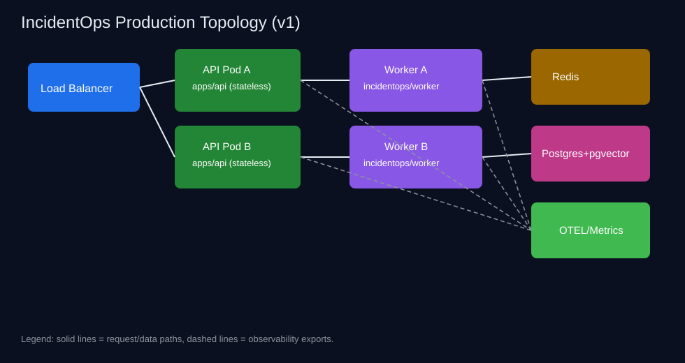
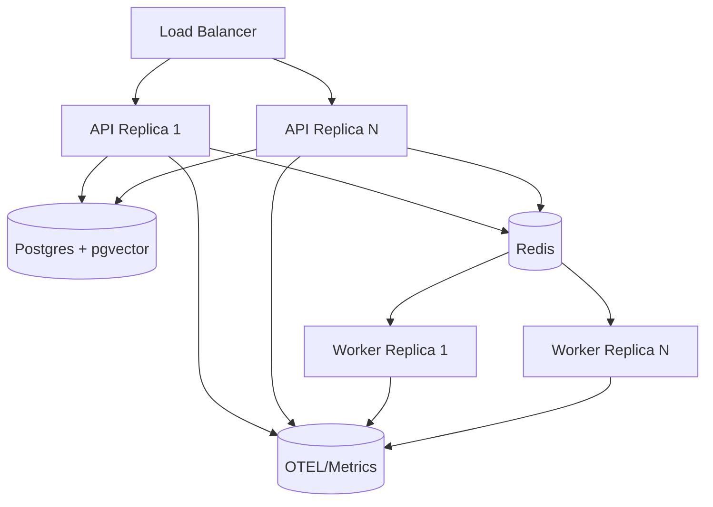
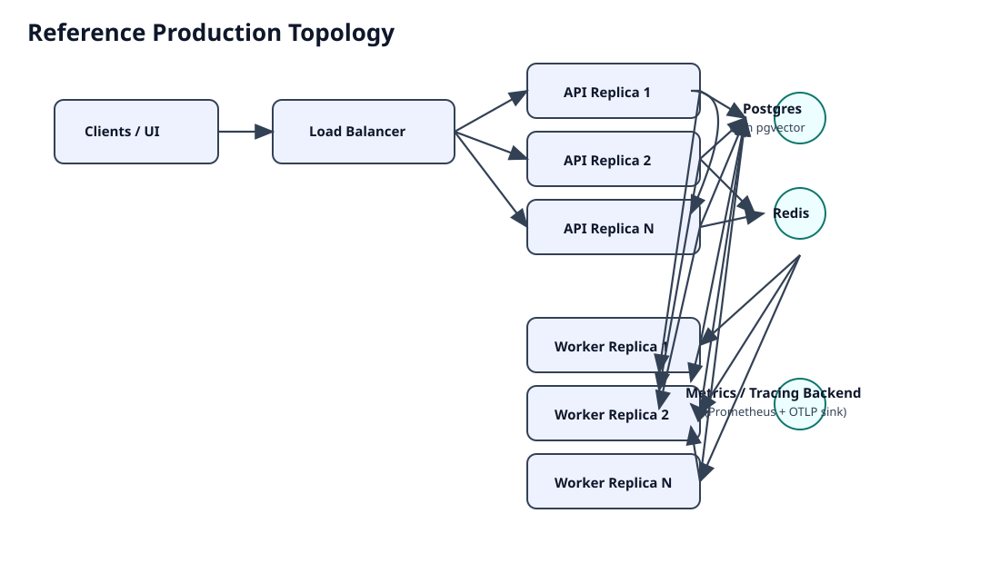
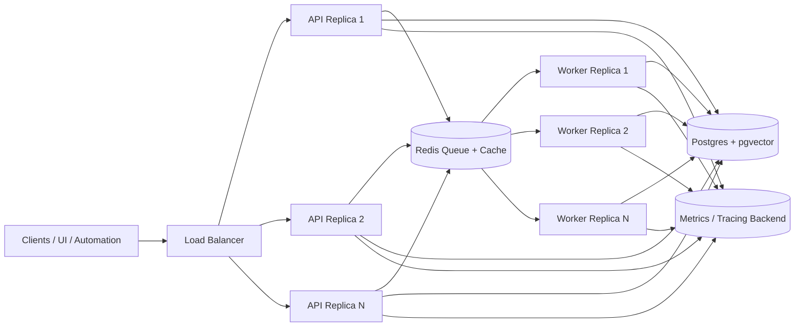

# Deployment

> Back to docs index: [docs/README.md](./README.md)

## Reference Production Topology





## Production Database Boot Sequence

1. Create a Postgres database.
2. Ensure the database supports pgvector.
3. Set `DATABASE_URL`.
4. Run migrations:

```bash
alembic upgrade head
```

5. Bootstrap an admin user:

```bash
python -m incidentops.security.bootstrap_admin \
  --email admin@example.com \
  --password "use-a-strong-password"
```

6. Start the API.
7. Verify liveness:

```bash
curl http://127.0.0.1:8001/health
```

8. Verify readiness:

```bash
curl http://127.0.0.1:8001/ready
```

## Environment Modes

Supported modes:

```text
APP_ENV=local
APP_ENV=development
APP_ENV=staging
APP_ENV=production
```

`DB_CREATE_ALL=false` is the default. `DB_CREATE_ALL=true` is only honored in `local` or `development` and exists for developer convenience. It is ignored in `staging` and `production`.

Production rule: run Alembic migrations before starting the app. The app must not create schema with SQLAlchemy `create_all` in production.

## Production Security Settings

Set these explicitly for staging/production:

```text
JWT_SECRET=<strong-random-secret-at-least-32-chars>
JWT_ALGORITHM=HS256
JWT_ISSUER=incidentops
JWT_AUDIENCE=incidentops-api
ACCESS_TOKEN_EXPIRE_MINUTES=60
ALLOW_LOCAL_SEED_ADMIN=false
ALLOW_DEMO_PROJECT_BYPASS=false
DEMO_MODE_PUBLIC=false
RATE_LIMIT_BACKEND=redis
WORKER_MODE=queue
JOB_QUEUE_BACKEND=redis
REDIS_URL=redis://...
METRICS_BACKEND=prometheus
CORS_ALLOW_ORIGINS=https://your-ui.example.com
ALLOW_WILDCARD_CORS=false
```

Startup fails in staging/production if default JWT secrets, local seed admin, demo bypass, wildcard CORS, `DB_CREATE_ALL=true`, in-memory rate limiting, inline worker mode, non-Redis job queues, or memory-only metrics are configured.

Passwords are stored with bcrypt. Legacy SHA256 hashes are only accepted in local/development and are rehashed after a successful login.

Source config must not contain raw credentials. Put secret material in a secret manager and pass only a `credentials_ref`.

## Collector Ingestion Limits

Collector batch ingest is bounded by:

```text
MAX_DOCUMENTS_PER_BATCH=100
MAX_DOCUMENT_BYTES=2000000
MAX_BATCH_BYTES=10000000
MAX_CHUNKS_PER_DOCUMENT=500
MAX_METADATA_BYTES=64000
MAX_EXTERNAL_ID_LENGTH=1024
MAX_PATH_LENGTH=2048
```

If a whole batch exceeds count or byte limits, the API rejects the request. If one document is invalid or oversized, the batch response includes a per-document error and continues indexing valid documents. Error responses do not include raw document content.

Production ingestion should use the source/collector/sync/document-batch APIs. `/v1/projects/{project_id}/ingest` remains available for local development and server-visible folder smoke tests only.

## Worker Runtime

Production should run the API and at least one worker process:

```bash
uvicorn apps.api.main:app --host 0.0.0.0 --port 8000
python -m incidentops.worker
```

The API validates auth/RBAC, creates persisted workflow or eval records, enqueues jobs, and returns IDs. The worker pulls jobs, executes deterministic workflow/eval logic, persists status/events/results, and records audit events.

Runtime settings:

```text
WORKER_MODE=queue
JOB_QUEUE_BACKEND=redis
WORKFLOW_NODE_TIMEOUT_SECONDS=60
WORKFLOW_MAX_RETRIES=1
WORKFLOW_RUN_TIMEOUT_SECONDS=300
EVAL_RUN_TIMEOUT_SECONDS=600
JOB_POLL_INTERVAL_SECONDS=2
```

Local development may use `WORKER_MODE=inline` and `JOB_QUEUE_BACKEND=inline`.

## Rollout Strategy

1. **Migration-first:** run `alembic upgrade head` before shifting traffic.
2. **Canary APIs:** deploy one API replica first, verify `/ready`, then scale out.
3. **Worker skew management:** keep workers at same schema-compatible version; drain old workers before destructive schema changes.
4. **Rollback order:**
   - stop new deploy rollout,
   - revert API replicas,
   - drain/restart workers,
   - rollback schema only when backward compatibility is impossible and data impact is understood.

Safe abort criteria: readiness failures, elevated 5xx, queue age growth, workflow timeout surge.

## Capacity Planning Baseline

Primary bottlenecks:

- embedding/LLM call throughput,
- Postgres IOPS for hybrid retrieval,
- Redis queue latency/depth under burst ingest + investigate load.

Initial heuristics:

- API replicas sized by p95 request latency and auth/search concurrency.
- Worker count sized by median workflow wall time and queue SLO.
- Keep ingest batch sizes under hard limits and prefer smaller batches for lower tail latency during peak.

## RBAC

Roles are project-scoped:

- `viewer`: read evidence/search results, runs, reports, and eval results.
- `investigator`: create investigations, answers, workflow runs, and local/dev ingests.
- `approver`: approve or reject gated workflow actions.
- `admin`: manage sources, collectors, syncs, document batch ingest, project settings, members, and eval runs.

Project membership is enforced for source/sync/search/answer/investigate/runs/evals/approvals. Local demo project bypass is available only outside staging/production when explicitly enabled.

## Audit Events

The `audit_events` table records login success/failure, project creation, source and collector changes, sync lifecycle, document batch ingest, investigations, workflow runs, approval decisions, eval runs, permission denials, and rate-limit blocks. Audit metadata is redacted before storage.

## Checks

`/health` is a lightweight liveness check and returns process health.

`/ready` checks:

- database connectivity
- pgvector extension
- required application tables
- Alembic current revision against head revision

Run the same readiness check from the CLI:

```bash
python scripts/check_migrations.py
```

Run an API-level production smoke:

```bash
python scripts/smoke_prod.py \
  --base-url http://127.0.0.1:8001 \
  --email admin@incidentops.local \
  --password incidentops \
  --query "What does this tiny service evidence say?"
```

The smoke test checks health, readiness, login, project/source/collector/sync creation, normalized batch ingest, search, investigate, workflow run polling, and a small eval when the API can access the generated case file.

## SLOs and Alerts

| Signal | Target / Alert Threshold | Why it matters |
|---|---|---|
| `/ready` success rate | page if consecutive failures > 2 intervals | indicates platform/db/migration integrity |
| workflow completion latency p95 | alert on sustained breach vs SLO | detects degraded queue/LLM/dependency behavior |
| queue depth age | alert when oldest queued run exceeds SLO | detects under-provisioned or stalled workers |
| ingest rejection rate | alert on anomaly spike | detects source-side regressions or abuse |
| auth failure rate | alert on anomaly spike | detects credential attacks/misconfiguration |
| eval pass-rate drift | alert on significant drop | detects model/prompt/regression issues |

## Day-2 Operations

- **Secret rotation:** rotate JWT secret and upstream provider credentials with controlled token expiry overlap.
- **Failed migration recovery:** pause rollout, restore compatibility, re-run migration checks, resume incrementally.
- **Worker maintenance drain:** stop job intake, let in-flight jobs complete, then restart workers.

## Observability

Set `ENABLE_OTEL=true` to enable OpenTelemetry hooks. Configure `OTEL_SERVICE_NAME` and `OTEL_EXPORTER_OTLP_ENDPOINT` when an OTLP collector is available. If tracing dependencies or exporters are unavailable, the app continues without tracing.

Metrics endpoints:

```text
GET /v1/metrics/summary
GET /metrics
```

Metrics cover HTTP requests, ingestion counters, retrieval/search latency, investigation latency, workflow runs/nodes/failures, eval runs/cases, and LLM calls when configured.

## Reference Production Topology

Static architecture companion image:



Mermaid deployment diagram:



## Rollout Strategy

1. **Migration-first deployment**
   - Run `alembic upgrade head` against production before any new API or worker rollout.
   - Confirm `/ready` is green and `python scripts/check_migrations.py` passes before shifting traffic.
2. **Canary API rollout**
   - Roll one API replica with the new version first.
   - Route a small traffic slice (for example 1-5%), validate auth, ingest, workflow submit, and `/ready`, then expand progressively.
3. **Worker version skew**
   - Keep job payloads backward-compatible across at least one version during rollout.
   - Roll workers gradually; verify old workers can ignore unknown fields and new workers can process jobs created by canary APIs.
   - Avoid introducing destructive schema assumptions in worker code until all workers are upgraded.
4. **Rollback order and safe abort criteria**
   - Abort rollout if `/ready` fails repeatedly, queue age spikes, workflow completion latency regresses materially, or ingest rejection rate jumps.
   - Roll back in this order: API traffic shift -> canary API version -> worker fleet version.
   - Do **not** roll back database migrations that have already been used by live write traffic unless a tested downgrade path exists.

## Capacity Planning Baseline

Key initial bottlenecks to monitor:

- **Embedding throughput**: model/token throughput often caps ingestion and retrieval enrichment.
- **Database IOPS/CPU**: pgvector similarity search and write-heavy ingest can saturate storage and CPU.
- **Queue latency/age**: backlog growth indicates under-provisioned workers or downstream dependency slowness.

Initial sizing heuristics (starting point, then tune with real traffic):

- **API replicas/concurrency**
  - Start with 2+ stateless API replicas behind the load balancer.
  - Target p95 request CPU below ~70% and keep 20-30% burst headroom.
  - Increase replica count before increasing per-process concurrency if tail latency rises.
- **Worker replicas/concurrency**
  - Start with at least 2 worker replicas for redundancy.
  - Size total worker concurrency so sustained queue age remains below your SLO threshold under peak ingest/run load.
  - Scale worker count first when queue depth-age rises while API utilization is stable.

Ingest batch sizing recommendations (aligned to enforced limits above):

- Keep normal batches at ~50-80 documents even though `MAX_DOCUMENTS_PER_BATCH=100`.
- Prefer staying below ~70-80% of `MAX_BATCH_BYTES=10000000` to reduce rejection risk from size variance.
- Keep individual documents well under `MAX_DOCUMENT_BYTES=2000000` and chunk counts far below `MAX_CHUNKS_PER_DOCUMENT=500` to avoid outlier processing stalls.
- Apply client-side preflight checks for document bytes, metadata bytes, and path/external ID lengths before submit.

## SLOs and Alerts

| Signal | SLO / Alert Threshold (example baseline) | Alert Condition | Suggested Immediate Action |
|---|---|---|---|
| `/ready` failures | 99.9% successful over 5m windows | >1% failures for 5m, or 3 consecutive failures on any replica | Pull replica from load balancer, inspect DB/migration state, run `check_migrations.py`. |
| Workflow completion latency p95 | p95 < 120s (production baseline) | p95 > 180s for 15m | Check queue age, worker saturation, DB slow queries, and external model latency. |
| Queue depth age | Oldest queued job < 60s | Oldest queued job > 300s for 10m | Scale workers, inspect stuck jobs, verify Redis health and worker connectivity. |
| Ingest rejection rate | < 1% of ingest requests | > 3% for 10m | Inspect validation errors, batch-size patterns, and upstream payload changes. |
| Auth failure anomaly | Stable baseline by tenant/project | 3x baseline auth failures for 10m | Investigate credential rotation, JWT issuer/audience mismatch, brute-force patterns. |
| Eval pass-rate drift | Within expected band for golden set | >10 percentage-point drop over rolling day | Freeze promotion, inspect model/config changes, review failing eval categories. |

## Day-2 Operations

### Rotate Secrets

- Store secrets in a dedicated secret manager and rotate JWT/DB/Redis credentials on a scheduled cadence.
- Roll secrets using dual-publish windows where possible (accept old+new briefly, then remove old).
- After rotation, verify `/ready`, login, job enqueue/dequeue, and metrics export paths.

### Recover from Failed Migration

1. Stop further rollout and keep traffic on known-good app replicas.
2. Capture migration error logs and current revision (`make db-current`).
3. If safe and tested, apply corrective forward migration; prefer roll-forward over downgrade.
4. Re-run `alembic upgrade head` and `python scripts/check_migrations.py`.
5. Only resume canary traffic once `/ready` and smoke checks are stable.

### Drain Workers for Maintenance

1. Disable new workload intake path (or reduce upstream enqueue rate).
2. Let workers continue until queue depth-age approaches zero.
3. Gracefully stop workers after in-flight jobs finish; avoid hard kills for long-running tasks.
4. Perform maintenance, restart workers, then re-enable normal enqueue rate.
5. Watch queue age and workflow latency for post-maintenance regression.

## Make Commands

```bash
make migrate
make migration-check
make db-current
make db-history
make db-downgrade
make worker
make smoke-prod
make metrics-check
```
