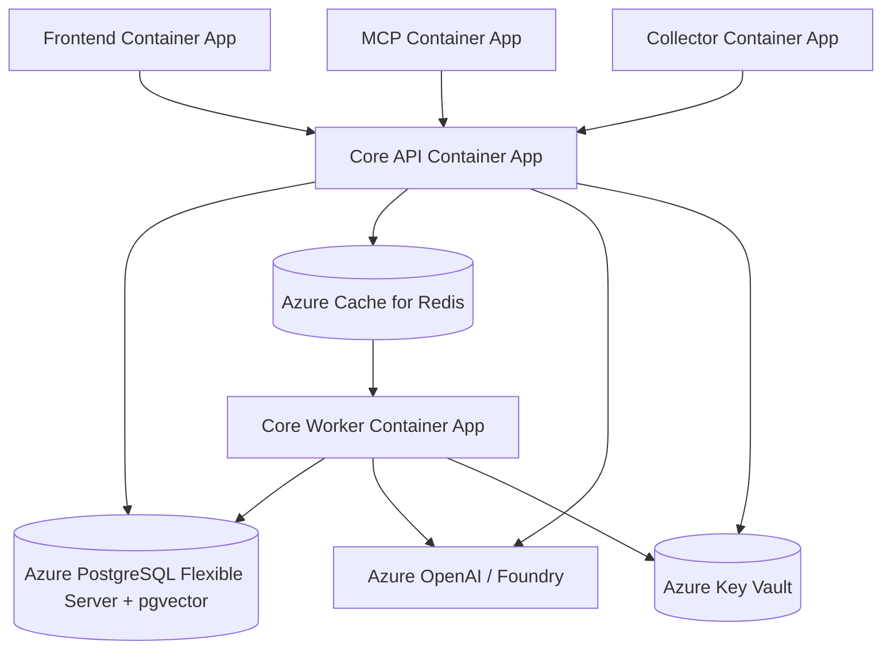

# Deployment

> Back to docs index: [docs/README.md](./README.md)

The active production deployment path is Azure.

## Azure Production Topology



## Required Production Boot Sequence

1. Build and push Core and Collector images to Azure Container Registry. Frontend image build/deploy is supported by the scripts but disabled by default in the current Core GitHub workflow.
2. Deploy Azure infrastructure from `infra/azure/main.bicep`.
3. Run migrations:

```bash
scripts/azure_run_migrations.sh
```

4. Bootstrap admin:

```bash
scripts/azure_bootstrap_admin.sh
```

5. Run smoke:

```bash
scripts/azure_smoke.sh
```

## Required Production Settings

```text
APP_ENV=production
DB_CREATE_ALL=false
DB_REQUIRE_MIGRATIONS=true
LOCAL_INGEST_ENABLED=false
ENABLE_LOCAL_INGEST=false
ALLOW_LOCAL_SEED_ADMIN=false
ALLOW_DEMO_PROJECT_BYPASS=false
DEMO_MODE_PUBLIC=false
WORKER_MODE=queue
JOB_QUEUE_BACKEND=redis
RATE_LIMIT_BACKEND=redis
METRICS_BACKEND=prometheus
METRICS_PUBLIC=false
CORS_ALLOW_ORIGINS=https://your-frontend-url
ALLOW_WILDCARD_CORS=false
REQUIRE_AZURE_OPENAI=true
AZURE_OPENAI_ENDPOINT=https://your-resource.openai.azure.com
AZURE_OPENAI_API_KEY=<Key Vault secret>
AZURE_OPENAI_CHAT_DEPLOYMENT=<chat deployment name>
AZURE_OPENAI_EMBEDDING_DEPLOYMENT=<embedding deployment name>
EMBEDDING_MODEL=azure-openai
EMBEDDING_DIM=384
```

Startup fails in staging/production if unsafe local/demo settings are enabled or Azure OpenAI / Foundry is not configured.

## MCP Runtime

The MCP server runs as a separate Core process:

```bash
python -m incidentops.mcp.server
```

Azure uses:

```text
MCP_TRANSPORT=streamable-http
MCP_HOST=0.0.0.0
MCP_PORT=8080
MCP_PATH=/mcp
MCP_CORE_API_URL=https://core-api-url
MCP_TOKEN=<Core access token>
```

The MCP server delegates to Core APIs. It does not ingest data, normalize files, bypass RBAC, or perform independent diagnosis.

## Checks

`/health` is process liveness.

`/ready` verifies:

- database connectivity
- pgvector extension
- required tables
- required columns
- Alembic revision at head

CLI check:

```bash
python scripts/check_migrations.py
```

Azure smoke:

```bash
scripts/azure_smoke.sh
```

## Security Notes

- Store secrets in Azure Key Vault.
- Do not commit generated deployment output or local env files.
- Do not expose PostgreSQL, Redis, worker, Collector, or MCP internal ports publicly without an explicit auth gateway.
- Production local ingest is disabled.
- Collector is the production ingestion path.

## Rollback

1. Stop rollout.
2. Restore the previous image tag in Container Apps.
3. Restart API, worker, MCP, Collector, and frontend apps.
4. Re-run `/ready` and `scripts/azure_smoke.sh`.
5. Avoid database downgrades unless a tested downgrade migration exists.
