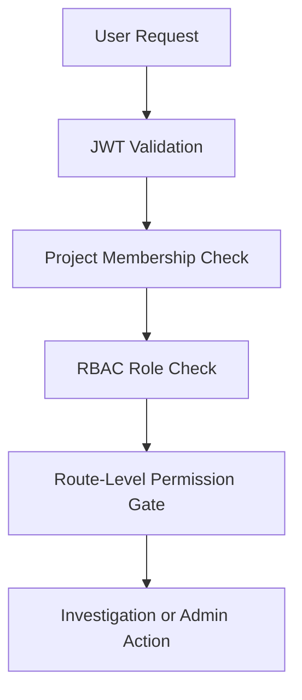

# Security · [Docs Hub](./README.md)

## Security Controls

- local JWT auth
- project RBAC: viewer, investigator, approver, admin
- untrusted evidence wrapper
- suspicious-instruction detection
- secret redaction
- output sanitization
- rate limiting and request-size controls

## Auth and Authorization Diagram

## Critical Security Configuration Variables

| Variable | Default | Required | Environment Scope | Purpose |
| --- | --- | --- | --- | --- |
| `JWT_SECRET` | none | yes | all | Signs and verifies local JWT tokens |
| `JWT_EXPIRES_IN` | `3600` | no | all | Token TTL in seconds |
| `RATE_LIMIT_PER_MINUTE` | `60` | no | api | Request throttling per client |
| `MAX_REQUEST_BYTES` | `1048576` | no | api | Request payload size guardrail |

## Rollback Guidance

If a security hardening change blocks valid traffic or breaks auth:

1. Revert to the previous known-good security configuration and deployment image.
2. Rotate affected secrets only if exposure is suspected; otherwise keep current keys to avoid broad token invalidation.
3. Validate JWT auth, RBAC checks, and rate-limit behavior in staging before reapplying the change.
