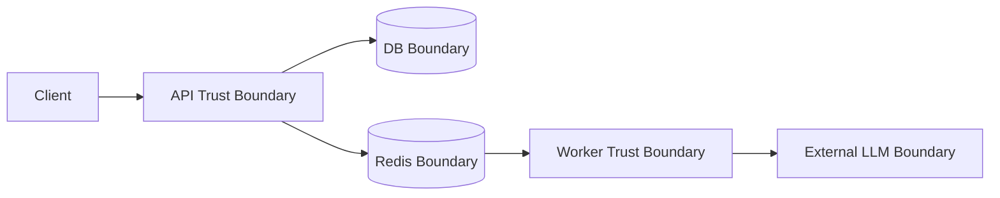
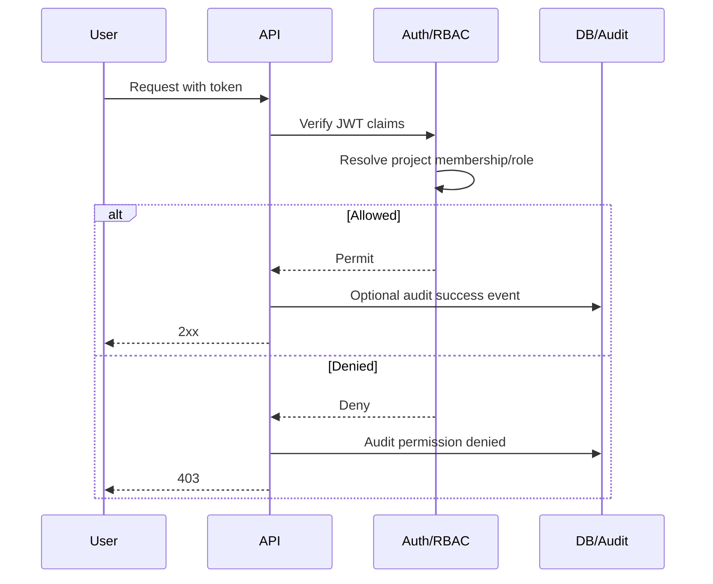
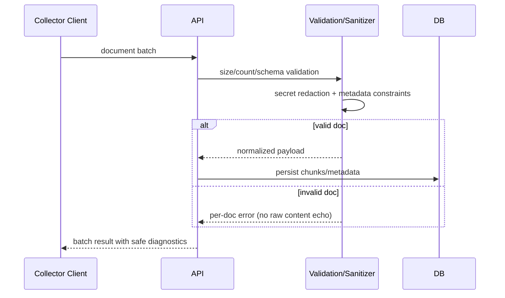
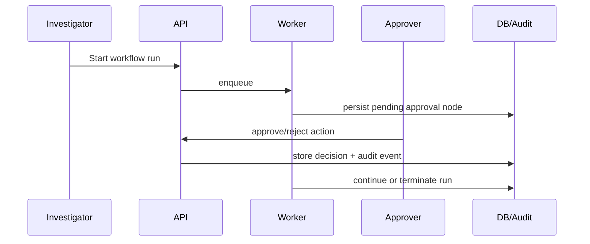

# Security

> Back to docs index: [docs/README.md](./README.md)

## Security Objectives

- **Confidentiality:** protect evidence, auth tokens, and source credential references.
- **Integrity:** ensure workflow/eval outcomes are attributable and tamper-evident via persisted events and audit trails.
- **Availability:** maintain service under load/abuse with rate limiting, request-size controls, and queue-based execution.
- **Least privilege:** enforce project-scoped RBAC and per-route authorization.
- **Traceability:** persist auditable security-relevant actions and denials.

## Threat Model

### Actors

- External attacker probing auth/ingest endpoints.
- Compromised user/session token attempting lateral project access.
- Malicious or careless insider with elevated project permissions.

### Protected Assets

- JWT secret material and auth tokens.
- Credential references and secret-manager links for sources.
- Evidence corpus and investigation/report outputs.
- Audit events and run/event history.

### Attack Surfaces

- Auth/login and token-bearing API requests.
- Ingestion and document batch endpoints.
- Retrieval/query path and generated answer/report surfaces.
- Worker queue and long-running workflow execution path.

## Trust Boundaries

- **API boundary:** identity, RBAC, request validation, sanitization entry point.
- **Worker boundary:** deterministic execution and approval gate enforcement.
- **DB boundary:** persistence for runs, evidence, and audit events.
- **Redis boundary:** queue and distributed rate-limit state.
- **External LLM boundary:** untrusted generation output requires sanitization/guardrails before return.

## Security Flow: Auth + RBAC

## Security Flow: Ingestion Validation and Redaction

## Control Matrix

| Control Area | Mechanism | Config Keys | Failure Behavior | Validation Method |
|---|---|---|---|---|
| Authentication | JWT auth and token validation | `JWT_SECRET`, `JWT_ISSUER`, `JWT_AUDIENCE`, `JWT_ALGORITHM` | auth fails closed (401/403) | login + protected route checks; audit events |
| Authorization | Project-scoped RBAC roles | project membership/role bindings | permission denied and audited | cross-role API tests |
| Rate limiting | request throttling backend | `RATE_LIMIT_BACKEND`, `REDIS_URL` | request blocked / deny response | load test + audit/metrics review |
| Request size controls | ingest/document payload limits | `MAX_*` ingest limit settings | oversized payload rejected | boundary tests on batch/doc size |
| Secret handling | credentials ref policy, redaction | source config `credentials_ref` | insecure raw credentials rejected/redacted | source create/update validation |
| Queue execution safety | queue mode for long runs | `WORKER_MODE`, `JOB_QUEUE_BACKEND` | startup guardrails in prod env | startup + readiness + workflow run checks |
| Output safety | output sanitization + prompt injection controls | sanitizer/guardrail settings | suspicious output filtered or flagged | adversarial prompt tests |
| Auditability | persisted audit events | audit event storage settings | security action missing => detection gap | verify audit rows for auth/denials |

## Approval-Gated Action Flow

## Security Runbooks

### 1) JWT Secret Rotation

1. Generate a strong replacement secret and stage it securely.
2. Roll API with new secret under controlled deployment window.
3. Force token refresh by reducing/expiring old token lifetime.
4. Monitor auth failure anomalies and rollback only if systemic outage appears.

### 2) Admin Bootstrap Hardening

1. Ensure `ALLOW_LOCAL_SEED_ADMIN=false` in staging/production.
2. Use one-time bootstrap credentials and rotate immediately after first login.
3. Validate audit event entries for bootstrap/login and permission changes.

### 3) Prompt Injection Response

1. Identify suspicious instruction patterns from workflow outputs/logs.
2. Quarantine impacted run IDs and preserve evidence snapshots.
3. Review sanitization and suspicious-instruction detection behavior.
4. Patch guardrails/prompts/tests and re-run eval/security regressions.

## Verification Checklist

- `curl /health` and `curl /ready` succeed in production deployment.
- `python scripts/check_migrations.py` confirms schema head alignment.
- RBAC negative test returns denial and records an audit event.
- Oversized ingest payloads are rejected without leaking raw content.
- Approval-gated actions remain blocked until explicit approver decision.

