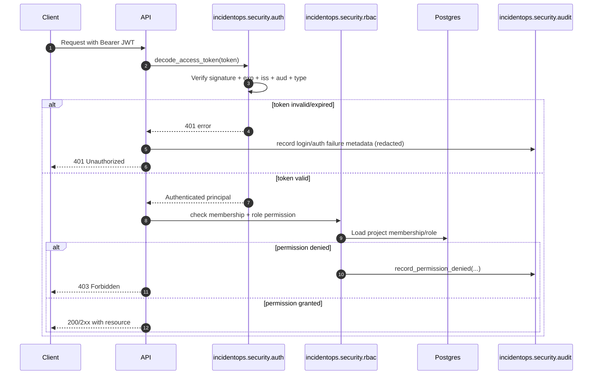
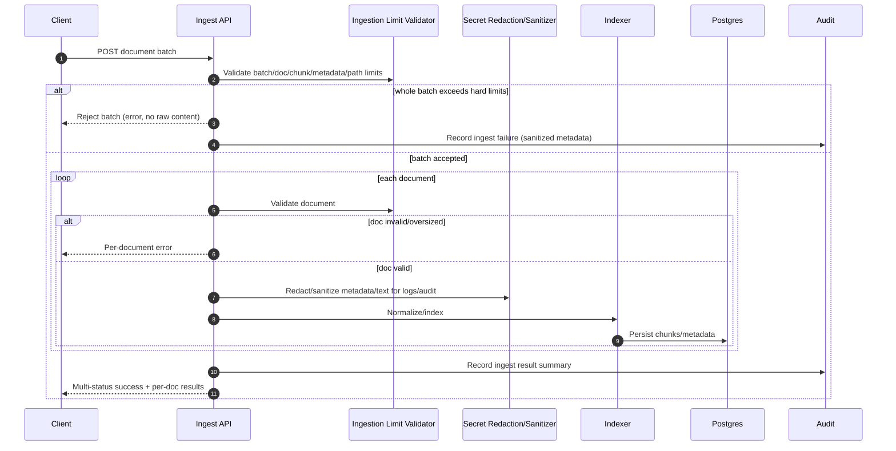
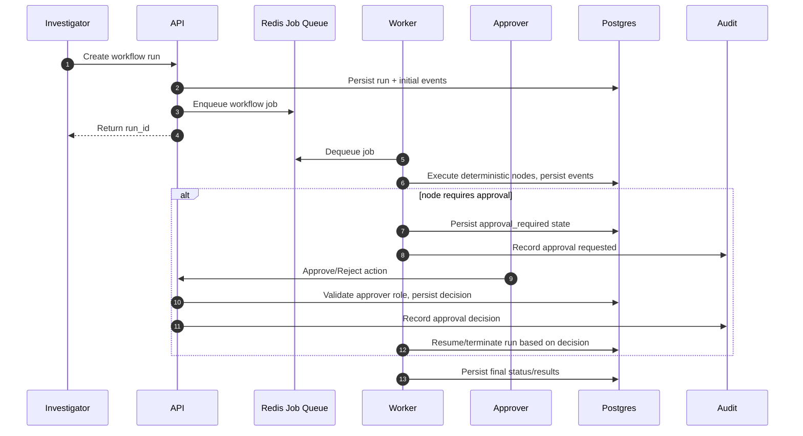

# Security

## Security Objectives

- **Confidentiality**: protect secrets and sensitive evidence by enforcing authenticated access, project-scoped role checks, and secret redaction for logs/audit metadata and sanitized outputs.
- **Integrity**: ensure only authorized users mutate project resources (sources, collectors, syncs, ingests, workflow/eval state) and that worker actions are persisted with status/event history and audit trails.
- **Availability**: keep service responsive with rate limiting, bounded ingestion payload sizes, Redis-backed queue processing in production, and explicit health/readiness checks.
- **Least privilege**: apply project roles (`viewer`, `investigator`, `approver`, `admin`) and enforce membership checks on source/sync/search/answer/investigate/runs/evals/approvals.
- **Traceability**: capture auditable security and workflow events (login outcomes, permission denials, ingest/sync/workflow/eval lifecycle, approval decisions, and rate-limit blocks) in `audit_events` with redacted metadata.

## Threat Model

### Threat actors

- **External attacker**: attempts to access APIs without valid credentials, abuse ingest endpoints with oversized/malicious payloads, or exploit weak environment settings.
- **Compromised user token**: a valid but stolen JWT is used to access project data or trigger actions outside intended scope.
- **Malicious insider**: an authenticated user with legitimate access attempts unauthorized cross-project actions, data exfiltration, or unsafe workflow approvals.

### Protected assets

- **JWT secrets/config**: `JWT_SECRET`, issuer/audience/algorithm token validation settings.
- **Source credential references**: `credentials_ref` pointers (raw credentials are disallowed in source config).
- **Evidence corpus**: normalized/batch-ingested documents and retrieval context used for investigations/workflows.
- **Audit logs**: `audit_events` records used for forensic traceability and control verification.

### Primary attack surfaces

- **Auth endpoints**: login/token issuance and token validation paths.
- **Ingest APIs**: source/collector/sync/document-batch plus local ingest path (`/v1/projects/{project_id}/ingest` for local/dev smoke only).
- **Retrieval query path**: search/answer/investigation requests handling untrusted evidence text.
- **Worker queue**: API enqueue path and worker dequeue/execute path in `WORKER_MODE=queue` with Redis backends.

## Trust Boundaries

- **API boundary**
  - Boundary between untrusted client input and validated internal operations.
  - Enforced by JWT validation, RBAC checks, request size/ingest limits, and rate limiting.
- **Worker boundary**
  - Boundary between synchronous API request handling and asynchronous job execution.
  - API persists run/eval intent, enqueues jobs, and worker executes deterministic nodes with timeout/retry controls.
- **Database boundary**
  - Boundary for durable state (users, memberships, evidence, runs, evals, audit events).
  - Readiness checks validate connectivity, pgvector presence, required tables, and Alembic head alignment before accepting production traffic.
- **Redis boundary**
  - Boundary for shared runtime controls in production (`RATE_LIMIT_BACKEND=redis`, `JOB_QUEUE_BACKEND=redis`).
  - Startup policy disallows in-memory substitutes in staging/production for rate limiting and queueing.
- **External LLM/provider boundary**
  - Boundary between internal evidence pipeline and external model providers.
  - Evidence is treated as untrusted, wrapped/inspected for suspicious instructions, and sanitized/redacted before downstream use/output.

## Control Matrix

| Control Area | Mechanism in code/config | Config keys | Failure behavior | Validation method |
|---|---|---|---|---|
| JWT authentication | JWT issue/verify with required `iss`, `aud`, `alg`, expiry, and token type validation | `JWT_SECRET`, `JWT_ALGORITHM`, `JWT_ISSUER`, `JWT_AUDIENCE`, `ACCESS_TOKEN_EXPIRE_MINUTES` | Invalid/expired/wrong-type token returns `401`; production-like startup rejects weak/default JWT settings | Call protected endpoint with invalid token and expect `401`; successful login then authorized call with valid token |
| Project RBAC | Project-scoped roles + permission policy + membership enforcement for project resources/actions | (role assignment data in DB), `ALLOW_DEMO_PROJECT_BYPASS`, `DEMO_MODE_PUBLIC` | Unauthorized action denied; permission-denied audit event recorded; bypass disabled in staging/production | Use lower-privileged user to call admin/approval endpoint and expect denial + audit event |
| Admin bootstrap hardening | Explicit bootstrap command with production-like weak-password guard and audit recording | `BOOTSTRAP_ADMIN_EMAIL`, `BOOTSTRAP_ADMIN_PASSWORD`, `BOOTSTRAP_ADMIN_NAME`, `ALLOW_LOCAL_SEED_ADMIN` | Weak production-like bootstrap password rejected; local seed admin disabled in staging/production | Run bootstrap in production-like env with weak password and expect failure; verify audit event for create/check |
| Secret handling & redaction | Central secret redaction patterns applied to audit metadata and output sanitization | (N/A runtime key), plus secure source pattern requiring `credentials_ref` not raw credentials | Secret-like tokens are replaced (`[REDACTED_*]`) before storage/output | Inject token-like strings into metadata/output path and verify redacted markers appear |
| Ingestion guardrails | Bounded batch/document/chunk/metadata/path sizes; per-document validation errors; no raw content in error payloads | `MAX_DOCUMENTS_PER_BATCH`, `MAX_DOCUMENT_BYTES`, `MAX_BATCH_BYTES`, `MAX_CHUNKS_PER_DOCUMENT`, `MAX_METADATA_BYTES`, `MAX_EXTERNAL_ID_LENGTH`, `MAX_PATH_LENGTH` | Whole batch rejected for global size/count breaches; invalid docs fail individually while valid docs continue | Submit oversized batch/doc and confirm reject/per-doc errors with no raw document leak |
| Rate limiting | Redis-backed limiter in production paths; denial audit for abuse | `RATE_LIMIT_BACKEND`, `REDIS_URL` | Redis backend required in production-like mode; excess requests blocked and auditable | Burst requests over limit and verify blocked responses + rate-limit audit entries |
| Worker execution safety | Queue-backed async execution with deterministic node engine, timeouts, retries, persisted events | `WORKER_MODE`, `JOB_QUEUE_BACKEND`, `WORKFLOW_NODE_TIMEOUT_SECONDS`, `WORKFLOW_MAX_RETRIES`, `WORKFLOW_RUN_TIMEOUT_SECONDS`, `EVAL_RUN_TIMEOUT_SECONDS`, `JOB_POLL_INTERVAL_SECONDS` | Production startup rejects inline/in-memory worker config; timed-out/retried nodes recorded in run events | Start in queue mode, trigger run, verify queued execution/event trail and timeout handling |
| Production readiness gate | Readiness endpoint + migration check CLI validates DB, pgvector, tables, Alembic revision | `DATABASE_URL`, `DB_CREATE_ALL` | `/ready` or migration check fails when schema/revision prerequisites are not met | `curl /ready` and `python scripts/check_migrations.py` both pass before rollout |

## Sequence Diagrams

### Authentication + RBAC check flow



### Ingestion request validation + redaction path



### Approval-gated workflow action



## Security Runbooks

### 1) JWT secret rotation

1. Generate a new strong secret (`>=32` chars) in your secret manager.
2. Update runtime config with new `JWT_SECRET` (keep `JWT_ALGORITHM`, `JWT_ISSUER`, `JWT_AUDIENCE` unchanged unless performing coordinated token contract change).
3. Roll restart API instances so token verification uses the new secret consistently.
4. Invalidate existing sessions/tokens as required by your session policy (forced re-authentication window).
5. Verify:
   - New logins succeed.
   - Old tokens fail validation (`401 Invalid token`).
   - `audit_events` include expected login success/failure records.

### 2) Admin bootstrap hardening

1. Ensure production-like config explicitly sets:
   - `ALLOW_LOCAL_SEED_ADMIN=false`
   - `ALLOW_DEMO_PROJECT_BYPASS=false`
   - `DEMO_MODE_PUBLIC=false`
2. Bootstrap admin only via:
   ```bash
   python -m incidentops.security.bootstrap_admin --email <admin-email> --password '<strong-password>'
   ```
3. Enforce strong bootstrap password policy; never use weak defaults (`incidentops`, `password`, `admin`, `change-me`) in production-like environments.
4. Confirm admin membership role assignment in target project(s).
5. Review `bootstrap_admin_created` / `bootstrap_admin_checked` audit events.

### 3) Incident response: suspicious prompt injection

1. Detect: monitor investigation/workflow traces and user reports for suspicious instruction markers in retrieved evidence.
2. Contain:
   - Pause affected workflow runs at approval gates.
   - Restrict write-capable roles if active abuse is suspected.
3. Eradicate:
   - Isolate and review offending evidence/source documents.
   - Re-run ingestion with corrected source hygiene if needed.
4. Recover:
   - Resume runs only after approver validation.
   - Re-check output sanitization/redaction behavior on representative prompts.
5. Post-incident:
   - Review audit trail for scope/timeline.
   - Add detection patterns/tests for newly observed injection variants.

## Verification Checklist

Run these checks during deployment or security validation.

1. **Health check (liveness)**
   ```bash
   curl -fsS http://127.0.0.1:8001/health
   ```
   **Expected outcome:** HTTP `200` and process-liveness response.

2. **Readiness check (dependency + schema gate)**
   ```bash
   curl -fsS http://127.0.0.1:8001/ready
   ```
   **Expected outcome:** HTTP `200`; database reachable, pgvector installed, required tables present, and Alembic current revision equals head.

3. **Migration check (CLI parity with readiness)**
   ```bash
   python scripts/check_migrations.py
   ```
   **Expected outcome:** exits `0`; reports current revision at head.

4. **Auth failure audit event presence**
   ```bash
   # Example: call a protected endpoint with an invalid token, then inspect audit_events.
   curl -i http://127.0.0.1:8001/v1/projects -H 'Authorization: Bearer invalid.token.value'
   ```
   **Expected outcome:** request denied (`401`/`403` depending on path), and corresponding auth/permission failure event appears in `audit_events` with redacted metadata.
