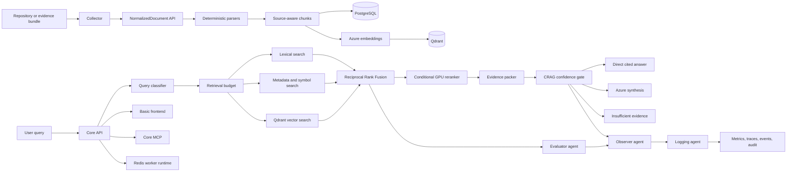

# IncidentOps Implementation Plan

## Purpose

IncidentOps is a cloud-first engineering-evidence RAG system. It ingests repositories, documentation, configuration, logs, deployment evidence, runbooks, and incident records; converts them into deterministic normalized documents and source-aware chunks; retrieves evidence through PostgreSQL lexical/metadata search and Qdrant vector search; reranks and validates that evidence; and produces cited answers without claiming unsupported root causes.

```text
Evidence source
  -> Collector discovery, policy, redaction, deterministic metadata
  -> Core NormalizedDocument API
  -> parsing and source-aware chunking
  -> PostgreSQL metadata/lexical index + Qdrant vector index
  -> query classification and retrieval budgets
  -> parallel lexical, metadata, symbol, and vector retrieval
  -> Reciprocal Rank Fusion
  -> conditional GPU reranking
  -> compact evidence pack
  -> CRAG confidence gate
  -> direct answer, Azure synthesis, or insufficient-evidence response
  -> evaluator, observer, and logging agents
  -> frontend, MCP, metrics, traces, and audit events
```

The work is organized into five phases. A phase is complete only after its acceptance criteria and verification gates pass. Static compilation is not cloud proof, and no metric may be published without a real measured run.

## Current Context

The primary repository is `Ops-Incident-Core`. It currently contains:

- FastAPI Core API, JWT authentication, RBAC, sources, syncs, normalized batch ingestion, search, answer, investigate, workflows, approvals, evals, readiness, metrics, runtime status, MCP, and worker runtime.
- The deterministic Collector under `incidentops/collector`, sharing the Core image but communicating with Core only through authenticated HTTP APIs.
- PostgreSQL business state and full-text search.
- A legacy embedding migration revision retained for upgrade compatibility.
- Redis worker queue and cache infrastructure.
- Azure OpenAI and remote Azure GPU model gateway configuration.
- Azure infrastructure and deployment scripts requiring renewed live validation.
- A minimal frontend under `apps/web`.

Important boundaries:

- The active vector path uses Qdrant. PostgreSQL stores business state, chunk text, metadata, and lexical indexes only.
- The migration chain supports clean Qdrant installs and removes legacy vector artifacts when they exist.
- PostgreSQL remains authoritative for projects, users, RBAC, sources, syncs, documents, chunk text/metadata, lexical search, workflows, evals, audits, and citations.
- Qdrant owns vector indexing and vector candidate retrieval only.
- Collector does not chunk, embed, retrieve, diagnose, access PostgreSQL, or use MCP.
- Core owns canonical parsing, chunking, embeddings, vector publication, retrieval, ranking, citations, answers, and operational agents.
- MCP remains an authenticated interface over Core APIs, never an ingestion or direct database path.
- Production cannot load local models. Deterministic local-hash embeddings remain only for offline tests.
- Azure deployment, model calls, latency, and token metrics must be measured again before any production claim.

## Target Architecture



## Ownership Model

| Component | Owns | Must not own |
|---|---|---|
| Collector | Discovery, file policy, secret redaction, deterministic metadata, hashes, batching, sync lifecycle | Chunking, embeddings, retrieval, diagnosis, DB access |
| Core API | Auth, RBAC, contracts, state, retrieval and answer APIs | Long model/index work in HTTP threads |
| Core worker | Parsing, chunking, embedding, Qdrant publication, workflows, operational agents | Public unauthenticated access |
| PostgreSQL | Business state, chunk text/metadata, lexical search, durable events | Vector similarity search |
| Qdrant | Versioned vectors and bounded filter payloads | Users, secrets, raw source ownership, workflow state |
| Azure models | Embeddings, conditional reranking, bounded synthesis and optional judging | Normalization, authorization, unbounded log processing |
| MCP | Authenticated Core tool interface | Ingestion, normalization, direct PostgreSQL/Qdrant access |
| Frontend | User workflows and safe visibility | Direct storage, queue, Collector, or model calls |

# Phase 1: Qdrant Foundation and Safe Vector Migration

## Goal

Replace the previous PostgreSQL vector path with Qdrant while preserving PostgreSQL business state, lexical search, citations, purge behavior, and upgrade compatibility.

## Status

Implemented and locally verified. Core writes and searches vectors through Qdrant, PostgreSQL retains authoritative chunk text and lexical search, fresh installs use stock PostgreSQL without vector extensions, and the cutover migration conditionally removes legacy vector artifacts. Azure deployment and live benchmark proof remain release gates in Phase 5.

## Deliverables

Add production settings:

```text
RETRIEVAL_BACKEND=qdrant
QDRANT_URL=
QDRANT_API_KEY=
QDRANT_COLLECTION=incidentops_chunks
QDRANT_TIMEOUT_SECONDS=10
VECTOR_INDEX_VERSION=current
```

Production and staging startup fail when Qdrant is missing, unhealthy, incompatible with the embedding dimension, or local fallback is active.

Create a vector-store interface supporting collection validation, upsert, filtered search, document/source/project deletion, and health checks. Qdrant payloads contain bounded metadata only:

```text
project_id, source_id, document_id, chunk_id
source_type, chunk_type, path, language
symbol_name, package_name, service_name, endpoint
commit_sha, deploy_hash, content_hash, index_version
```

Full text remains in PostgreSQL. Every Qdrant hit maps back to an authorized PostgreSQL chunk before it becomes evidence.

- Use deterministic Qdrant point IDs.
- Complete index jobs only after Qdrant acknowledges writes.
- Classify Qdrant failures as `vector_index_failed`, not parser errors.
- Filter retrieval by active index version.
- Replace changed-document vectors without mixed old/new versions.
- Invalidate caches after publication and deletion.

Purge behavior:

- Source deletion removes Qdrant points before database deletion completes.
- Project deletion removes all project points.
- Audit tombstones contain IDs and counts, never raw evidence.
- Full reingestion remains Collector-driven because Core does not own repository access.

Migration rules:

- Fresh installs create no PostgreSQL vector extension, vector column, or embedding table.
- The cutover migration conditionally removes legacy vector artifacts for existing databases.
- Validate clean installs and upgrades before every deployment.

Azure preference is managed Qdrant Cloud in an Azure region with authentication and backups. A Qdrant Container App is a disposable demo option, not a production durability claim. Qdrant must not have unauthenticated public ingress.

## Verification

- Fake vector-store unit tests.
- Qdrant HTTP/client contract tests.
- CI integration tests against ephemeral Qdrant.
- Dimension mismatch and unavailable-backend startup tests.
- Changed-document replacement and duplicate-point tests.
- Source/project purge and stale-point authorization tests.
- Runtime status reports Qdrant.
- Azure smoke confirms Qdrant health and retrieval.

## Acceptance Criteria

- Runtime vector search uses Qdrant only.
- New vectors are written only to Qdrant.
- Qdrant results remain project-scoped and RBAC-protected.
- Purge removes vectors and cached results.
- Repeat sync creates zero duplicate points.
- Changed-file updates replace old vectors correctly.
- Existing API contracts remain compatible.

# Phase 2: Collector, Parsing, Chunking, and Index Quality

## Goal

Produce high-signal, inspectable retrieval units for broad engineering evidence before applying expensive ranking or generation.

## Collector Deliverables

Collector deterministically provides repository, branch, commit SHA, path, language, source type, size, modified time, content hash, and safe symbol/heading/endpoint hints. It redacts before transmission, negotiates Core capabilities, enforces batch limits, retries bounded failures, and reports partial success honestly.

Collector skip taxonomy:

```text
unsupported_extension, generated_file, vendor_file, oversized,
empty, binary, malformed_content, metadata_invalid,
redaction_failed, read_failed, unknown
```

Collector hints are advisory. Core creates canonical chunks and embeddings.

## Core Chunk Types

```text
Go: go_package, go_function, go_method, go_struct, go_interface, go_fallback
Python: python_module, python_function, python_class, python_fallback
TypeScript: ts_module, ts_function, ts_class, ts_interface, ts_fallback
Java: java_package, java_method, java_class, java_interface, java_fallback
Protocol/API: proto_service, proto_rpc, proto_message, proto_enum,
              openapi_endpoint, openapi_schema, openapi_security
Docs: markdown_heading_section, markdown_table, markdown_procedure, markdown_faq
Logs: log_time_window, log_error_burst, log_trace_group, log_exception_block
Config: yaml_service_block, config_section, env_var_block, dependency_block
Deploy: deploy_commit, deploy_diff, release_marker
Incident: incident_symptom, incident_timeline, incident_root_cause, incident_action
```

Every chunk preserves project/source/document/chunk IDs, source/chunk type, path, language, symbol, package, service, endpoint, line range, commit/deploy hashes, content hash, generated/vendor flags, and index version.

Chunking rules:

- Prefer complete functions, methods, types, services, RPCs, and heading sections.
- Split oversized symbols only at syntax-safe boundaries with parent metadata.
- Bound token, character, and per-document chunk counts.
- Preserve precise path and line citations.
- Use fallback chunks for valid but structurally unsupported content.
- Deduplicate identical and near-identical chunks.
- Exclude or heavily penalize generated, vendor, cache, lock, build, and coverage files.
- Embed useful metadata prefixes without contaminating displayed citations.

Embedding and Qdrant publication run asynchronously. Production uses Azure-hosted embeddings, records model/revision/dimension/index version, retries transient failures, and never marks a sync fully indexed while vector jobs are pending or failed.

Required diagnostics include files, skips and reasons, documents created/updated/unchanged, chunks by type, parser errors by reason, chunk discard reasons, embedding failures, Qdrant failures, source types, and active index version.

## Verification

- Parser tests for every source type.
- Fake-secret redaction benchmark.
- Collector/Core contract tests.
- Repeat-sync and changed-file tests.
- Citation and line-range tests.
- Chunk explosion and malformed-file tests.
- Worker retry and partial-success tests.
- Two real repositories and one synthetic incident evidence pack.

## Acceptance Criteria

- Go, Python, TypeScript, Java, proto, docs, config, logs, diffs, and incidents produce source-aware chunks.
- Valid evidence is not silently lost.
- Parser failures are typed and measurable.
- Qdrant publication matches PostgreSQL chunk state.
- Duplicate vectors after resync equal zero.
- Changed-file replacement correctness is 100% in benchmark cases.

# Phase 3: Advanced Hybrid RAG, RRF, GPU Reranking, CRAG, and GraphRAG

## Goal

Build general retrieval that adapts to question type, combines independent evidence channels, minimizes expensive model calls, and refuses unsupported conclusions.

## Query Routing

Classify queries as:

```text
code_location, architecture, config_lookup, api_contract,
runtime_incident, deploy_regression, previous_incident,
runbook_lookup, generic
```

Use deterministic classification first. A remote model may resolve low-confidence ambiguity with a strict timeout and deterministic fallback.

Retrieval budgets:

| Intent | Preferred evidence |
|---|---|
| Code location | 70% code/proto/API, 20% exact docs, 10% config |
| Architecture | 40% docs, 35% code, 25% API/proto |
| Config lookup | 60% config, 20% deploy, 20% docs/code |
| API contract | 60% API/proto/OpenAPI, 25% code, 15% docs |
| Runtime incident | 35% logs, 20% deploy, 15% incidents, 15% code, 15% runbooks |
| Deploy regression | Deploy, code, logs, incidents |
| Previous incident | Incidents, runbooks, logs |
| Runbook lookup | Runbooks and operational docs |
| Generic | Balanced retrieval |

Run Qdrant vector, PostgreSQL lexical, exact path/symbol, metadata-filtered, and applicable time/deploy/graph branches concurrently. Every branch has a timeout, candidate budget, latency metric, and explicit failure state.

Use weighted Reciprocal Rank Fusion:

```text
rrf_score = sum(branch_weight / (60 + rank_in_branch))
vector=0.40, lexical=0.30, metadata/symbol=0.20,
time/graph=0.10 when applicable
```

Boost exact symbol/path/package/service/endpoint/source/chunk/deploy/time matches. Penalize wrong-intent evidence, README dominance for code questions, boilerplate, generated/vendor files, lockfiles, and near duplicates.

## Conditional GPU Reranking

Call the Azure-hosted reranker when top RRF scores are close, source types conflict, exact matches are absent, or the query is ambiguous/high-consequence. Skip it for decisive code, config, and API matches. Record model deployment, latency, candidate count, and score changes.

## Evidence and CRAG

Evidence packs contain 5-8 chunks, 1200-1800 characters per chunk, and 8000-12000 total characters. Include path, line range, source/chunk type, metadata, retrieval reason, and citation; remove overlap and boilerplate.

CRAG combines branch agreement, source suitability, exact matches, reranker confidence, diversity, citation coverage, and missing evidence:

```text
high -> direct cited answer or bounded synthesis
medium -> cited answer with caveats
low -> hypotheses and missing-data warnings
insufficient -> no causal claim; list required evidence
```

Exact code/config/API matches use a direct fast path. Runtime RCA without logs, deploys, or incidents returns insufficient evidence without an expensive model call.

## GraphRAG

Construct deterministic repository, service, package, module, function, endpoint, config, deploy, incident, log-error, and runbook nodes. Supported edges are `contains`, `calls`, `implements`, `configures`, `deploys`, `mentions`, `fails_with`, `documented_by`, and `changed_by`. Enable graph expansion only for architecture, ownership, service-boundary, and dependency questions. LLMs do not invent graph edges.

Authorized diagnostics expose intent/confidence, budgets, branch counts/latencies/failures, RRF counts, source/chunk distributions, boosts/penalties, rerank use/latency, evidence size, total latency, and cache hits. They never expose secrets or large content.

## Acceptance Criteria

- Code questions rank code/proto above generic docs when code exists.
- Runtime questions prioritize operational evidence or report its absence.
- RRF improves query-class evals over the previous fusion baseline.
- Reranking is conditional and shows measurable gain when called.
- Citations survive direct, reranked, and synthesized paths.
- Search p50 is below 500 ms and p95 below 1.5 seconds in the target Azure benchmark.
- Exact answers are below 2 seconds; normal answer p50 is 4-8 seconds and p95 below 15 seconds.
- Token usage drops 40-70% from the recorded large-context baseline.

# Phase 4: Evaluator, Observer, and Logging Agents with Runtime Hardening

## Goal

Operate RAG quality as a measurable system using bounded worker agents with durable state, typed inputs/outputs, timeouts, retries, audit events, and model-call budgets.

Agent rules:

- Agents run through Redis workers, not API threads.
- Inputs are project-scoped and bounded; outputs use typed schemas.
- Production model calls use Azure-hosted deployments.
- Deterministic checks remain authoritative for safety and thresholds.
- Agents cannot access secrets, unrestricted databases, or raw tokens.
- Agents cannot automatically change ranking configuration or delete data.

Evaluator agent responsibilities:

- Run query-class eval suites and compare model/index/retrieval versions.
- Measure recall@5/10, source-type hit rate, wrong-source rate, zero results, top-path relevance, citation rate, forbidden terms, RRF/rerank gain, latency, tokens, call count, and estimated cost.
- Use optional evidence-bound LLM judging only as a secondary metric.
- Record failed cases without crashing the whole run.

Observer agent responsibilities:

- Detect parser-loss spikes, Qdrant write errors/stale points, ranking drift, latency/token regressions, excessive reranking, cache failures, confidence mismatches, and unsupported causal claims.
- Produce structured findings with severity, evidence, threshold, and recommended action.
- Report recommendations without autonomously mutating production.

Logging agent flow:

```text
event -> redaction -> schema validation -> classification ->
severity -> metrics/traces/events/audit -> optional aggregate summary
```

It handles ingestion, parser, embedding, Qdrant, retrieval, reranking, answer, insufficient-evidence, eval, observer, workflow, and security events. It never logs raw documents, full evidence packs, secrets, JWTs, passwords, keys, or connection strings. Optional AI summaries operate only on aggregated redacted findings.

Runtime requirements:

- Redis Streams acknowledgement and stale-job recovery.
- Separate indexing, eval, observer, workflow, and aggregate-summary jobs.
- Per-job timeout, bounded retries, idempotency keys, and sanitized dead-letter records.
- OpenTelemetry spans for embeddings, Qdrant, lexical search, RRF, reranking, packing, synthesis, eval, and observer runs.
- Prometheus metrics for API, ingestion, retrieval, models, Qdrant, workers, agents, and caches.

Cache query classification, embeddings, retrieval IDs, evidence packs, readiness, and runtime status. Keys include project, query hash, backend, model/revision, Qdrant index version, and latest source version. Invalidate on sync, purge, reindex, model change, and collection switch.

Core MCP exposes authenticated capability, runtime, readiness, search, investigate, sync, run-event, and eval-summary tools. It cannot ingest, normalize, or access storage directly.

## Acceptance Criteria

- All three operational agents run as durable worker jobs.
- Their events, retries, failures, latency, tokens, and calls are inspectable.
- Eval regressions can block deployment.
- Observer findings identify real quality/performance failures without auto-mutation.
- Logging remains safe when model services are unavailable.
- Cached repeat retrieval is below 250 ms where cloud network conditions permit.
- Cache invalidation prevents deleted or stale vectors from appearing.

# Phase 5: Basic Frontend, Azure Deployment, Live Benchmarks, and Release Proof

## Goal

Expose the real system clearly, deploy it reproducibly, and prove the architecture on broad repositories and operational evidence without fake metrics or local services.

## Basic Frontend

Use the existing `apps/web` Next.js application unless an audit proves replacement is necessary. Keep it compact and operational.

Required pages:

1. Login with existing JWT handling and safe expiry behavior.
2. Project overview with sources, sync, documents, chunks, failures, Qdrant publication, and readiness.
3. Sources with Collector status, commit, counts, diagnostics, and authorized purge/reindex actions.
4. Search with filters, cited evidence, paths/lines, types, fused score, retrieval reason, and authorized diagnostics.
5. Investigation with confidence, answer or refusal, hypotheses, missing data, citations, model, tokens, and latency.
6. Readiness with coverage, gaps, answerable/weak questions, actions, and suggested questions.
7. Evaluations with query-class quality, latency, tokens/calls, version comparisons, and failures.
8. RAG operations with Qdrant health/index, backlog, parser failures, branch latency, reranker/cache rates, and observer findings.
9. Workflow runs with status, node events, retries, evidence count, approval state, drafts, and failures.
10. Runtime status with environment, Qdrant, PostgreSQL metadata, model providers, worker, MCP, index version, and fallback warning.

The browser calls Core only. It never calls Qdrant, PostgreSQL, Redis, Collector, or model endpoints. It displays unknown values honestly and implements empty, loading, unauthorized, timeout, partial-failure, and failed states. Destructive actions require RBAC and confirmation.

## Azure Target

```text
Azure Container Registry
Core API, worker, Collector, frontend, and MCP Container Apps
Migration and bootstrap jobs
PostgreSQL Flexible Server
Redis
managed Qdrant in an Azure region, preferred
Azure OpenAI embeddings and synthesis
Azure GPU reranker endpoint
Key Vault
Log Analytics and Azure Monitor
```

Only frontend and authenticated Core API ingress are public. MCP is protected. Collector, worker, PostgreSQL, Redis, and Qdrant remain internal or access-restricted.

CI/CD must run lint/tests/evals, build images, validate Bicep, push to ACR, run migrations/checks, deploy, verify Qdrant dimension, bootstrap through secrets, and run cloud, MCP, browser, and bounded post-deploy eval smokes. GitHub OIDC subscription and role configuration must be proven before claiming CI/CD works.

## Live Benchmark Matrix

- Temporal for Go, proto, services, and architecture.
- A medium Python backend with code, docs, config, Docker, and API structure.
- A medium TypeScript/Node backend.
- A synthetic evidence pack with timestamped logs, deploy history/diff, runbook, config, API evidence, and postmortem.

Each corpus gets a clean sync, repeat sync, changed-file sync, duplicate-point check, query-class evals, ten representative questions, and search/answer/investigate/readiness/workflow/MCP checks.

Required reports include repository/commit, file and skip counts, documents, chunks by type, parser/Qdrant failures, sync duration, idempotency, changed-file correctness, duplicate points, recall, source-type quality, zero results, citations, RRF/rerank gain, branch/model latency, tokens, calls, estimated cost, cache rate, readiness gaps, observer findings, and MCP success.

## Release Gates

- Search p50 below 500 ms and p95 below 1.5 seconds in the defined Azure environment.
- Exact code/config/API answer below 2 seconds.
- Normal model-backed answer p50 4-8 seconds and p95 below 15 seconds.
- Token usage reduced 40-70% from a recorded large-context baseline.
- Duplicate Qdrant points after resync: zero.
- Changed-file correctness: 100% in benchmark cases.
- Initial answerable-query recall@5 at least 70%, raised as eval coverage matures.
- Zero-result rate below 20% for answerable queries.
- Runtime RCA without operational evidence remains cautious.
- No secrets in source, logs, diagnostics, audits, Qdrant payloads, reports, or Git history.
- No local service or model is required for final cloud proof.
- Browser and MCP paths return real Core-backed data.

## Final Definition of Done

IncidentOps is credible only when all five phases pass live validation:

1. Collector deterministically ingests broad engineering evidence and explains every skip.
2. Core creates source-aware chunks with precise citations.
3. Qdrant is the only production vector backend; PostgreSQL remains the authoritative metadata and state store.
4. Hybrid retrieval uses lexical, metadata, symbol, vector, and selected graph branches with RRF.
5. Conditional GPU reranking improves measured quality without taxing every query.
6. CRAG prevents unsupported certainty and reports missing evidence.
7. Evidence packing controls latency and token cost.
8. Evaluator, observer, and logging agents run durably and safely.
9. Redis caching accelerates repeated queries without stale evidence.
10. The basic frontend exposes ingestion, readiness, retrieval, investigation, evals, and operations.
11. MCP exposes authenticated Core tools without becoming an ingestion or storage path.
12. Azure CI/CD, migrations, Qdrant, models, smokes, browser, MCP, and eval gates pass.
13. Multiple real repositories and a complete incident evidence pack produce honest, repeatable reports.
14. Published metrics identify the exact environment, corpus, model/index versions, and limitations.

Until then, the accurate description is: **an implemented and testable IncidentOps architecture under validation**, not a production-grade RAG platform.
