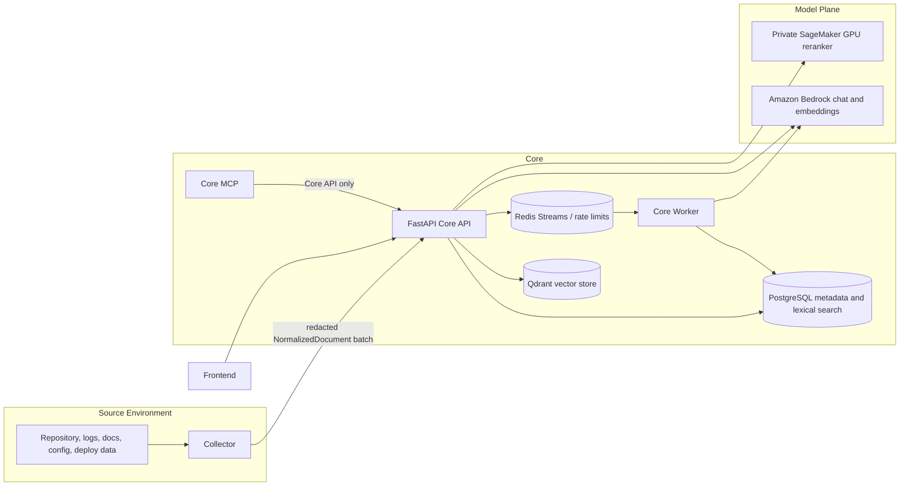

# IncidentOps Technical Architecture

## Status and Scope

IncidentOps is an engineering-evidence system, not a generic chatbot. It
ingests deterministic, redacted evidence from its in-repository Collector runtime, stores and
indexes it in Core, retrieves cited evidence, and provides search,
investigation, workflow, evaluation, readiness, and MCP interfaces.

This document is the single source of technical documentation for the Core
repository. It describes code and intended cloud deployment boundaries. It does
not claim that a cloud component is live unless a successful deployment smoke
has recorded it. As of 2026-07-29, the AWS provider contracts and Terraform
deployment path are implemented and under repository validation. No successful
live AWS deployment, model preflight, backup/restore drill, or benchmark is
recorded yet. The remaining Azure deployment files are temporary cutover
artifacts, not the target runtime.

### Version context

This repository is the active **v2 architecture rewrite**. The earlier v1
implementation referenced in resume or portfolio material used a
PostgreSQL/pgvector-era vector path and earlier deployment boundaries. This
codebase retires PostgreSQL vector storage in favor of Qdrant, keeps Collector
inside the repository, and adds durable indexing and hybrid retrieval work.
It is a current engineering effort, not a completed production release.

### How to read this document

* **Implemented** means the code and tests exist in this repository.
* **Configured** means settings, manifests, or deployment scripts exist.
* **Validated** requires a recorded runtime test against the target environment.

Unless this document explicitly says a behavior was validated, treat it as
implemented or configured only. This distinction is intentional: deployment
scaffolding and a passing local harness do not prove cloud reliability.

## Repositories and Responsibilities

| Repository | Owns | Does not own |
|---|---|---|
| `Ops-Incident-Core: incidentops.collector` | source access, path policy, redaction, deterministic metadata extraction, `NormalizedDocument` production, sync checkpoints | retrieval, embeddings, model calls, incident diagnosis, database access |
| `Ops-Incident-Core: Core services` | auth/RBAC, projects, sources, syncs, parsing/chunking, indexing, retrieval, investigation, workflows, evals, audit, MCP facade | arbitrary filesystem crawling outside configured Collector roots |
| `Ops-Incident-Core: apps/web` | minimal operator-facing UI over Core APIs | evidence normalization or authorization bypass |

The Collector-to-Core boundary is intentional even though both runtimes share
one repository and image: Collector has access to source material; Core has
project-scoped data and retrieval authority. Collector uses authenticated HTTP
only and cannot access PostgreSQL directly. MCP is a Core interface only. It
must call Core APIs with scoped credentials and cannot
ingest, normalize, access PostgreSQL directly, or bypass RBAC.

## End-to-End Flow



### Ingestion lifecycle

1. A user creates a project and source, then a Collector is registered.
2. Collector discovers allowed files, redacts secrets, extracts deterministic
   metadata, and sends `NormalizedDocument` batches with source/sync metadata.
3. Core validates document size, metadata, path, batch limits, and duplicate
   external IDs. It records typed failures rather than silently dropping them.
4. Core parses, chunks, embeds, and publishes vectors through a durable index
   job when asynchronous indexing is enabled; the API does not wait for remote
   GPU embedding in that mode.
5. The worker dispatches durable job IDs through Redis Streams, recovers
   pending/abandoned jobs from Postgres, obtains embeddings, replaces changed
   document chunks transactionally, and updates sync diagnostics.
6. A finished sync reports source coverage, parser/error counts, chunk counts,
   unchanged skips, and async indexing state.

Raw documents are not sent in Redis job payloads. The durable database job is
the source of truth; Redis is transport and recovery coordination.

### Search and answer lifecycle

```mermaid
sequenceDiagram
  participant U as User or MCP Client
  participant API as Core API
  participant Q as Intent Router
  participant V as Qdrant Vector Search
  participant L as PostgreSQL Full Text Search
  participant X as Metadata and Graph Search
  participant RR as SageMaker GPU Reranker
  participant M as Amazon Bedrock

  U->>API: query and project ID
  API->>Q: classify query
  Q->>V: vector budget
  Q->>L: lexical budget
  Q->>X: exact metadata/path; graph for architecture only
  V-->>API: vector candidates
  L-->>API: lexical candidates
  X-->>API: deterministic candidates
  API->>API: weighted RRF and source-aware boosts
  opt ambiguous candidate set
    API->>RR: bounded rerank request
    RR-->>API: scores
  end
  API->>API: compact cited evidence pack
  alt exact code/config/API lookup
    API-->>U: direct cited evidence answer
  else synthesis justified
    API->>M: compact evidence-only prompt
    M-->>API: constrained answer
    API-->>U: cited response with warnings
  end
```

## Data Contract

`NormalizedDocument` is the universal ingestion contract. It carries an
external ID, path, source type, content hash, normalized/redacted content,
metadata, source size, and optional modification time. Collector protocol
metadata (`collector_version`, `schema_version`, `core_api_version`) is stored
in sync diagnostics but is not hard-rejected for older Collectors.

Core data ownership is project-scoped:

| Data | Purpose |
|---|---|
| `projects`, memberships, users | project isolation and RBAC |
| `sources`, collectors, `source_syncs` | source registry and ingestion lifecycle |
| `documents`, `chunks` | authoritative evidence, chunk metadata, and lexical index |
| Qdrant collection | embeddings and bounded vector filter payloads |
| `index_jobs` | durable async parse/embed/publish work |
| runs, events, approvals, evals | workflow and evaluation state |
| `operational_runs`, `operational_findings`, `operational_events` | durable evaluator/observer/logging state and redacted runtime observations |
| audit events | security and destructive-operation traceability |

Changed `external_id` content replaces old chunks before publishing new chunks.
Unchanged content hashes are skipped. Source/project purge deletes retrieval
state and evidence while retaining a safe audit tombstone without raw content.
The current reindex endpoint refreshes existing chunks and search vectors; it
does not claim to refetch raw source data. Full reparse requires Collector
reingestion.

## Parsing and Chunking

Parsing is deterministic. No LLM normalizes source files.

| Source class | Main chunk types | Important metadata |
|---|---|---|
| Go | `go_module`, `go_type`, `go_function`, `go_method` | package, symbol, line range |
| Python/TS/Java | module/class/function chunks plus fallback | language, symbol, line range |
| Proto/OpenAPI | `proto_service`, `proto_rpc`, message/enum, API endpoint | package, endpoint, line range |
| Markdown | heading sections | title, heading, line range |
| Logs | `log_window`, bounded `error_cluster` | timestamps, levels, trace IDs, deploy hash, endpoint |
| JSON/YAML/TOML/INI | configuration or endpoint sections | config key, service, endpoint |
| Deploys/diffs | `deploy_diff` | deploy hash, service, changed files |
| Incidents | `incident_section` | symptom, root cause, timeline/action section |

Generated, binary, empty, oversized, malformed, or unsupported files are
reported using typed diagnostics. Important failure categories are
`unsupported_extension`, `generated_file`, `oversized`, `empty`, `binary`,
`malformed_content`, `parser_exception`, `metadata_invalid`,
`chunk_limit_exceeded`, `embedding_failed`, and `unknown`.

Fallback chunks are preferred to silent data loss, but chunk count and token
limits prevent a single malformed file from creating an unbounded index.

## Retrieval Design

### Vector storage

PostgreSQL is authoritative for chunk text, metadata, authorization, and
citations. Qdrant stores embedding vectors and bounded retrieval payloads.
Every vector hit is mapped back to an authorized PostgreSQL chunk before it is
returned. PostgreSQL does not store vector embeddings;
runtime indexing and retrieval use Qdrant.

### Query intent and budgets

The router classifies requests as `code_location`, `architecture`,
`config_lookup`, `api_contract`, `runtime_incident`, `deploy_regression`,
`previous_incident`, `runbook_lookup`, or `generic`.

| Intent | Preferred evidence |
|---|---|
| code location | code, proto/API chunks, exact symbols and paths |
| architecture | docs, packages, services, code boundaries |
| config lookup | config, deploy manifests, code/docs |
| API contract | OpenAPI/proto/API code |
| runtime incident | logs, deploys, incidents, runbooks, then code |
| deploy regression | deploy history/diffs, logs, code |
| previous incident | incident reports, runbooks, logs |

Vector, lexical, and exact metadata/path searches execute in parallel when
independent database sessions are available. Architecture queries also run a
bounded deterministic graph branch. Weighted reciprocal-rank fusion uses
vector `0.40`, lexical `0.30`, metadata/path `0.20`, and graph `0.10` when the
graph branch applies. Source type, chunk type, metadata, exact path/symbol,
service, endpoint, and deploy matches add bounded boosts. Generic README or
boilerplate evidence is penalized for code or runtime questions unless it is
an exact match.

The graph stores only direct facts derived during indexing: `contains`,
`defines`, `implements`, and `changed_by` edges across chunk IDs, paths,
services, packages, symbols, endpoints, and deploy hashes. It does not infer
call graphs, dependencies, or incident causality.

The reranker is conditional: it runs only for ambiguous candidate sets. Exact
or decisive code/config/API evidence uses a direct evidence path. Evidence is
deduplicated and constrained to 5-8 chunks, 1200-1800 characters per chunk,
and 8k-12k total characters before model synthesis.

### Diagnostics and metrics

Search debug output contains query intent, source/chunk distributions,
retrieval budget, boosts/penalties, branch timings, and total retrieval
latency. It excludes raw secrets and does not expose credentials.

Metrics cover ingest counts/failures, retrieval intent/source/chunk mix,
embedding/rerank calls and failures, cache hits/misses, workflow/eval events,
and average observed latencies. Query-class evaluations report evidence recall,
term coverage, source-type hit rate, wrong-source-type rate, p50/p95 latency,
and forbidden-term hits.

## Model Boundary

Core and Collector must not load production embedding or reranking models.
The Phase 6 model plane uses AWS managed inference through ECS task-role IAM:

| Endpoint | Model role | Contract |
|---|---|---|
| Amazon Bedrock Titan Text Embeddings V2 | embedding | one bounded text input -> normalized 1024-dimension vector |
| Private SageMaker endpoint | BGE-compatible cross-encoder reranking | bounded query/candidates -> one score per candidate |
| Amazon Bedrock Converse | answer synthesis | compact evidence-only prompt -> constrained cited response |

The SageMaker image embeds a model artifact pinned to an immutable Hugging Face
revision during the image build. Local model loading is disabled in production
and rejected by startup validation. A deterministic local-hash path remains for
development/CI compatibility only.

GPU retrieval requirements:

```text
RETRIEVAL_BACKEND=qdrant
QDRANT_URL=http://qdrant.<private-namespace>:6333
QDRANT_COLLECTION=incidentops_chunks
VECTOR_INDEX_VERSION=aws-v1
EMBEDDING_MODEL=aws-bedrock-titan-v2
BEDROCK_EMBEDDING_MODEL_ID=amazon.titan-embed-text-v2:0
BEDROCK_CHAT_MODEL_ID=<approved-model-or-inference-profile>
RERANKER_MODEL=BAAI/bge-reranker-v2-m3
SAGEMAKER_RERANKER_ENDPOINT_NAME=<private-endpoint-name>
RAG_GPU_ENDPOINT_REQUIRED=true
RAG_ASYNC_INDEXING=true
RAG_MODEL_REVISION=<immutable revision>
EMBEDDING_DIM=1024
```

GPU reranking is optional and disabled by Terraform by default because an
always-on `ml.g5.xlarge` endpoint is a material cost. When enabled, SageMaker
uses private subnets and a dedicated security group. Bedrock and SageMaker
credentials are never stored in application settings.

The current restricted AWS account limits RDS automated backup retention to one
day. Terraform supports 1-35 days; a paid production account should use at
least seven days and complete a database restore drill.

## API and Security

Core uses JWT authentication and project-scoped RBAC. Viewers can read allowed
project data; elevated roles are required for ingestion operations; project
admins are required for purge/reindex actions. The service enforces request,
query, batch, document, metadata, and diagnostics limits.

Security controls include bcrypt password hashing, source configuration secret
rejection, Collector redaction, output sanitization, prompt-injection flags,
rate limiting, audit events, and no raw evidence in audit metadata. Local
folder ingestion is not permitted in production. Metrics are private by
default. MCP has a separate scoped token and calls Core HTTP APIs only.

Important endpoints include:

```text
GET    /health
GET    /ready
GET    /v1/capabilities
GET    /v1/runtime/status
GET    /v1/projects
GET    /v1/projects/{project_id}/readiness
POST   /v1/projects/{project_id}/sources
POST   /v1/projects/{project_id}/collectors/register
POST   /v1/sources/{source_id}/syncs/start
POST   /v1/sources/{source_id}/documents/batch
POST   /v1/sources/{source_id}/syncs/{sync_id}/finish
DELETE /v1/projects/{project_id}/sources/{source_id}
DELETE /v1/projects/{project_id}
POST   /v1/projects/{project_id}/sources/{source_id}/reindex
GET    /v1/projects/{project_id}/sources/{source_id}/integrity
POST   /v1/search
POST   /v1/answer
POST   /v1/investigate
POST   /v1/runs
GET    /v1/projects/{project_id}/operations/runs
GET    /v1/projects/{project_id}/operations/findings
POST   /v1/projects/{project_id}/operations/observer/runs
POST   /v1/projects/{project_id}/operations/logging/runs
```

`/v1/runtime/status` is authenticated and returns only safe configuration
state, such as selected provider/backend, worker mode, and local-fallback
status. It never returns tokens, connection strings, passwords, or API keys.

## Operational Agents and Runtime Hardening

Phase 4 adds three bounded operational agents. They are worker jobs with
durable project-scoped records, not autonomous services with data-plane
authority.

| Agent | Input | Output | Explicit non-authority |
|---|---|---|---|
| Evaluator | persisted query-class evaluation cases | recall, source-type, zero-result, citation, latency, and deterministic model-usage summaries | cannot change ranking or configuration |
| Observer | recent syncs, index-job state, and latest evaluation summary | typed threshold findings and recommended actions | cannot delete, reindex, or modify evidence |
| Logging aggregate | bounded, redacted operational events | category/severity/event-type counts | cannot retain raw documents or prompts |

`operational_events` records bounded metadata from ingestion, async indexing,
search, answer, investigation, evaluator, observer, and worker failures. The
redaction boundary removes content, evidence, prompts, credentials, tokens,
passwords, API keys, authorization values, and connection strings before an
event is persisted. Events are useful for identifying where a pipeline is
degrading; they are not an evidence archive.

Worker jobs use per-type timeouts. Indexing, evaluator, observer, and logging
jobs can retry within `WORKER_JOB_MAX_RETRIES`; workflow approval actions are
not retried by this mechanism. Terminal job failures store only a safe error
code and emit a redacted operational event. The API exposes read-only
operational runs and findings to project viewers and restricts job submission
to project administrators.

OpenTelemetry spans cover worker dispatch, query embeddings, retrieval score
fusion, remote reranking, and evaluator execution when `ENABLE_OTEL=true`.
Metrics are best effort: a metrics failure must never fail a request or a
worker job. Project cache invalidation occurs after indexing changes, source
purge, project purge, and reindex refresh. At this stage query classification
is cached project-safely; full retrieval-result caching remains a later,
measured optimization rather than an undocumented correctness risk.

## Runtime and Deployment

The target runtime is AWS `us-east-1`. Terraform under `infra/aws/terraform`
creates a VPC with public ALB subnets and private application/data subnets;
ECS Fargate services for API, worker, frontend, Collector, and MCP; one-off
migration/bootstrap tasks; RDS PostgreSQL; TLS/encrypted ElastiCache Redis;
Secrets Manager; ECR; CloudWatch; and AWS Backup. Qdrant runs on a private EC2
instance with IMDSv2, no SSH/public address, an encrypted retained EBS data
volume, a pinned image, API-key authentication, Cloud Map DNS, and daily
backups. The public ALB forwards only to the frontend. Core is reached through
the frontend's fixed same-origin proxy and private Cloud Map service discovery.

SageMaker GPU reranking is an explicit billable option and is off by default.
Collector and MCP services also default to zero replicas until project-scoped
Core tokens are present. This avoids weakening JWT policy or launching a
service that cannot authenticate. NAT egress is enabled by default because
Collector Git access, Qdrant image pulls, AWS APIs, and external package paths
require egress; a later cost/security review can replace it with VPC endpoints
where those endpoints cover the traffic.

Deployment order:

1. Validate Core, frontend, and Terraform on every `core` push.
2. Bootstrap the retained encrypted S3 state bucket and the repository-and-
   environment-scoped GitHub OIDC role from `infra/aws/bootstrap`, then manually
   approve the `aws-production` environment. Long-lived AWS access keys are not
   stored in GitHub.
3. Create ECR repositories, then build and push immutable Core/frontend and
   optional pinned reranker images.
4. Apply Terraform with ECS services held at zero during first provisioning.
5. Run `alembic upgrade head` and `scripts/check_migrations.py` as a Fargate
   one-off task. Production never calls SQLAlchemy `create_all`.
6. Bootstrap an administrator from Secrets Manager and run Bedrock embedding,
   chat, and optional SageMaker reranker preflight.
7. Promote the new ECS task definitions, wait for API/worker/frontend
   stability, and run the API product smoke. MCP smoke runs inside the private
   VPC when a scoped project/token is supplied.
8. Start and record a Qdrant AWS Backup job, then perform a separately approved
   restore drill before release.

The workflow is intentionally manual for apply, so an ordinary push cannot
create AWS cost. Its existence and static validation do not prove a live
deployment. A successful OIDC run, migration/model/smoke gates, Qdrant restore,
clean reingestion, browser/MCP proof, and benchmark report are still required.
The Azure workflows remain manual-only until those AWS retirement gates pass.

### Browser Boundary

The Next.js console in `apps/web` is a same-origin client of Core. Its
`/api/[...path]` route forwards selected browser headers to the fixed runtime
`CORE_API_BASE_URL`; it does not proxy arbitrary URLs. Qdrant, PostgreSQL,
Redis, Collector, and model credentials are never browser configuration. The
container serves port 3000, so the ALB target group reaches port 3000 only.
The console displays Core-backed project/readiness/source/search/investigation/
workflow/evaluation/operations state and intentionally has no local-path ingest
control.

### Benchmark Harness Boundary

`python -m incidentops.collector benchmark` is a release harness, not Collector
daemon behavior. It can query Core only after a sync to record authorized search
and source-integrity counters. The production Collector daemon still only
discovers, redacts, normalizes, batches, and syncs evidence. Integrity output is
aggregate-only: document/chunk counts and duplicate chunk rows grouped by
document, type, line range, and text digest; it never returns source text.

## Evaluation and Proof Standard

Publishing a benchmark requires real values for:

| Category | Required metrics |
|---|---|
| Ingestion | files seen/skipped, skip reasons, normalized documents, chunks, parser/embedding failures, redactions, sync duration |
| Idempotency | unchanged skips, changed-file replacement, duplicate chunks |
| Retrieval | recall@5, source-type hit rate, wrong-source-type rate, zero-result rate, p50/p95 latency |
| Answer | citation count, provider/model, prompt/completion tokens when supplied, answer latency |
| Operations | readiness score, worker/index failures, cache hit rate, MCP tool success |

Two public repository benchmarks are useful for code/docs ingestion. They do
not prove runtime RCA. A genuine incident evidence pack with logs, deploy
history, runbooks, and postmortems is required before claiming root-cause
capability. This repository contains no retained, reproducible
multi-repository AWS benchmark report, so no Temporal-scale metric is current
product proof.

## Current Limits and Next Work

The system is not production-grade yet. Blocking gaps are:

1. Configure the AWS OIDC role, encrypted Terraform state bucket, protected
   GitHub environment, Bedrock model access, certificate/DNS, and budget alerts.
2. Deploy through the manual AWS workflow and prove migration, readiness,
   Bedrock, optional SageMaker, and ECS stabilization gates.
3. Run clean multi-repository ingestion and query-class evaluations with
   published measurements.
4. Validate async index recovery, cache invalidation, purge, and reingestion
   under failure/restart conditions in AWS.
5. Add evidence packs with real logs/deploys/incidents before claiming runtime
   RCA quality.
6. Complete and record a Qdrant backup restore drill and verify vector
   publication consistency after restore.

Until those are complete, the correct product claim is: IncidentOps is a
security-conscious, Collector-first engineering evidence backend with an
implemented but not live-validated AWS retrieval path.

## Implementation Ledger

| Area | Present in code | Validated in current repository | Important boundary |
|---|---|---|---|
| Collector, redaction, and normalized batch protocol | Yes | Unit/integration coverage | Collector cannot access Core storage directly. |
| PostgreSQL metadata, chunks, full-text search, and audit | Yes | Unit/integration coverage | PostgreSQL is authoritative for text, authorization, and citations. |
| Qdrant vector adapter and Qdrant migration | Yes | Local/test coverage | The current Bicep template does not create Qdrant. |
| Hybrid retrieval and direct evidence graph | Yes | Unit/integration coverage | The graph contains direct deterministic facts only. |
| Redis Streams queue and durable index jobs | Yes | Unit/integration coverage | Postgres remains the business-state authority. |
| Bedrock embedding/chat and SageMaker reranker contracts | Yes | Focused unit contracts | No current live AWS model preflight is recorded. |
| AWS ECS/RDS/Redis/Qdrant infrastructure and scripts | Yes | Terraform provider validation | No current live AWS deployment or restore drill is recorded. |
| Azure deployment artifacts | Temporarily retained | Historical scaffold only | Remove only after every AWS cutover gate passes. |
| Phase 4 operational agents and event redaction | Yes | Unit/integration coverage | Cloud durability and thresholds still need live AWS validation. |
| MCP facade | Yes | Unit/integration coverage | MCP delegates to Core HTTP APIs and cannot ingest. |
| Operator console and same-origin proxy | Yes | Frontend build plus isolated local proxy smoke | No live AWS frontend is currently deployed. |

## Operational Invariants

The following rules are architectural constraints, not optional conventions:

1. A vector hit is not returned until it maps to an authorized PostgreSQL chunk.
2. Collector redaction and path policy precede Core ingestion.
3. A changed document replaces prior chunks for the same external ID; unchanged
   hashes are skipped.
4. Redis transports work, but Postgres records the durable index-job state.
5. Purge removes project/source evidence from retrieval stores and retains only
   an audit tombstone without raw evidence.
6. Reindex refreshes existing Core-held artifacts. It is not a claim that Core
   can re-read an external source; full reparse requires Collector reingestion.
7. Production configuration rejects local model loading, memory-only rate
   limits, inline workers, wildcard CORS, local ingest, and `create_all`.
8. When logs, deploy data, or incident history are absent, investigation must
   return a missing-evidence warning rather than unsupported root-cause certainty.
