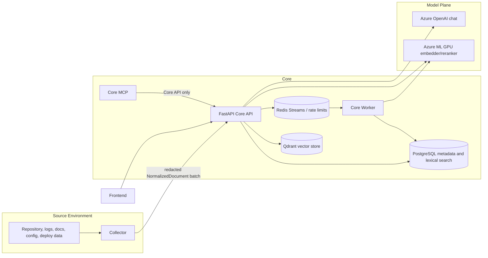
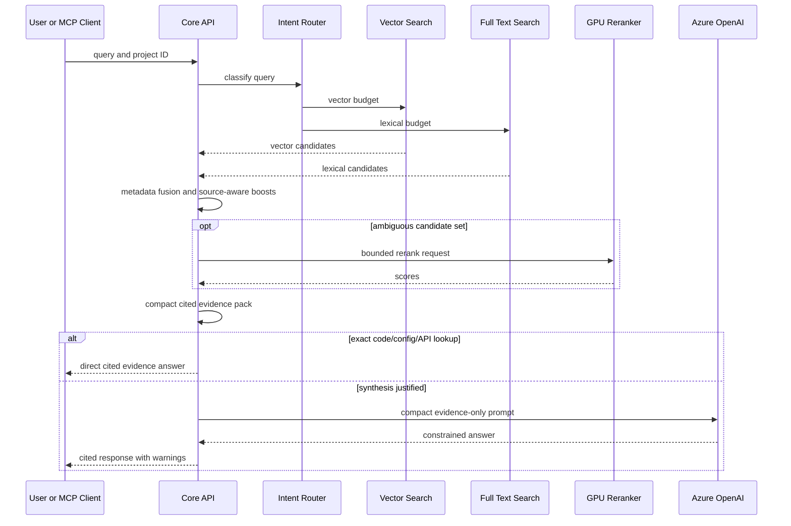

# IncidentOps Technical Architecture

## Status and Scope

IncidentOps is an engineering-evidence system, not a generic chatbot. It
ingests deterministic, redacted evidence from its in-repository Collector runtime, stores and
indexes it in Core, retrieves cited evidence, and provides search,
investigation, workflow, evaluation, readiness, and MCP interfaces.

This document is the single source of technical documentation for the Core
repository. It describes code and intended cloud deployment boundaries. It does
not claim that a cloud component is live unless a successful deployment smoke
has recorded it. At the time of this document, the cloud GPU retrieval path is code and
deployment scaffolding; its Azure deployment remains blocked on valid Azure
OIDC subscription configuration and private network connectivity.

## Repositories and Responsibilities

| Repository | Owns | Does not own |
|---|---|---|
| `Ops-Incident-Core: incidentops.collector` | source access, path policy, redaction, deterministic metadata extraction, `NormalizedDocument` production, sync checkpoints | retrieval, embeddings, model calls, incident diagnosis, database access |
| `Ops-Incident-Core: Core services` | auth/RBAC, projects, sources, syncs, parsing/chunking, indexing, retrieval, investigation, workflows, evals, audit, MCP facade | arbitrary filesystem crawling outside configured Collector roots |
| `Ops-Incident-frontend` | operator-facing UI over Core APIs | evidence normalization or authorization bypass |

The Collector-to-Core boundary is intentional even though both runtimes share
one repository and image: Collector has access to source material; Core has
project-scoped data and retrieval authority. Collector uses authenticated HTTP
only and cannot access PostgreSQL directly. MCP is a Core interface only. It
must call Core APIs with scoped credentials and cannot
ingest, normalize, access PostgreSQL directly, or bypass RBAC.

## End-to-End Flow



### Ingestion lifecycle

1. A user creates a project and source, then a Collector is registered.
2. Collector discovers allowed files, redacts secrets, extracts deterministic
   metadata, and sends `NormalizedDocument` batches with source/sync metadata.
3. Core validates document size, metadata, path, batch limits, and duplicate
   external IDs. It records typed failures rather than silently dropping them.
4. Core parses, chunks, embeds, and publishes vectors through a durable index
   job when asynchronous indexing is enabled; the API does not wait for remote
   GPU embedding in that mode.
5. The worker dispatches durable job IDs through Redis Streams, recovers
   pending/abandoned jobs from Postgres, obtains embeddings, replaces changed
   document chunks transactionally, and updates sync diagnostics.
6. A finished sync reports source coverage, parser/error counts, chunk counts,
   unchanged skips, and async indexing state.

Raw documents are not sent in Redis job payloads. The durable database job is
the source of truth; Redis is transport and recovery coordination.

### Search and answer lifecycle



## Data Contract

`NormalizedDocument` is the universal ingestion contract. It carries an
external ID, path, source type, content hash, normalized/redacted content,
metadata, source size, and optional modification time. Collector protocol
metadata (`collector_version`, `schema_version`, `core_api_version`) is stored
in sync diagnostics but is not hard-rejected for older Collectors.

Core data ownership is project-scoped:

| Data | Purpose |
|---|---|
| `projects`, memberships, users | project isolation and RBAC |
| `sources`, collectors, `source_syncs` | source registry and ingestion lifecycle |
| `documents`, `chunks` | authoritative evidence, chunk metadata, and lexical index |
| Qdrant collection | embeddings and bounded vector filter payloads |
| `index_jobs` | durable async parse/embed/publish work |
| runs, events, approvals, evals | workflow and evaluation state |
| audit events | security and destructive-operation traceability |

Changed `external_id` content replaces old chunks before publishing new chunks.
Unchanged content hashes are skipped. Source/project purge deletes retrieval
state and evidence while retaining a safe audit tombstone without raw content.
The current reindex endpoint refreshes existing chunks and search vectors; it
does not claim to refetch raw source data. Full reparse requires Collector
reingestion.

## Parsing and Chunking

Parsing is deterministic. No LLM normalizes source files.

| Source class | Main chunk types | Important metadata |
|---|---|---|
| Go | `go_module`, `go_type`, `go_function`, `go_method` | package, symbol, line range |
| Python/TS/Java | module/class/function chunks plus fallback | language, symbol, line range |
| Proto/OpenAPI | `proto_service`, `proto_rpc`, message/enum, API endpoint | package, endpoint, line range |
| Markdown | heading sections | title, heading, line range |
| Logs | `log_window`, bounded `error_cluster` | timestamps, levels, trace IDs, deploy hash, endpoint |
| JSON/YAML/TOML/INI | configuration or endpoint sections | config key, service, endpoint |
| Deploys/diffs | `deploy_diff` | deploy hash, service, changed files |
| Incidents | `incident_section` | symptom, root cause, timeline/action section |

Generated, binary, empty, oversized, malformed, or unsupported files are
reported using typed diagnostics. Important failure categories are
`unsupported_extension`, `generated_file`, `oversized`, `empty`, `binary`,
`malformed_content`, `parser_exception`, `metadata_invalid`,
`chunk_limit_exceeded`, `embedding_failed`, and `unknown`.

Fallback chunks are preferred to silent data loss, but chunk count and token
limits prevent a single malformed file from creating an unbounded index.

## Retrieval Design

### Vector storage

PostgreSQL is authoritative for chunk text, metadata, authorization, and
citations. Qdrant stores embedding vectors and bounded retrieval payloads.
Every vector hit is mapped back to an authorized PostgreSQL chunk before it is
returned. PostgreSQL does not store vector embeddings;
runtime indexing and retrieval use Qdrant.

### Query intent and budgets

The router classifies requests as `code_location`, `architecture`,
`config_lookup`, `api_contract`, `runtime_incident`, `deploy_regression`,
`previous_incident`, `runbook_lookup`, or `generic`.

| Intent | Preferred evidence |
|---|---|
| code location | code, proto/API chunks, exact symbols and paths |
| architecture | docs, packages, services, code boundaries |
| config lookup | config, deploy manifests, code/docs |
| API contract | OpenAPI/proto/API code |
| runtime incident | logs, deploys, incidents, runbooks, then code |
| deploy regression | deploy history/diffs, logs, code |
| previous incident | incident reports, runbooks, logs |

Vector and lexical searches execute in parallel when independent DB sessions
are available. Score fusion combines normalized vector and lexical scores with
source type, chunk type, metadata, exact path/symbol, service, endpoint, and
deploy boosts. Generic README or boilerplate evidence is penalized for code or
runtime questions unless it is an exact match.

The reranker is conditional: it runs only for ambiguous candidate sets. Exact
or decisive code/config/API evidence uses a direct evidence path. Evidence is
deduplicated and constrained to 5-8 chunks, 1200-1800 characters per chunk,
and 8k-12k total characters before model synthesis.

### Diagnostics and metrics

Search debug output contains query intent, source/chunk distributions,
retrieval budget, boosts/penalties, branch timings, and total retrieval
latency. It excludes raw secrets and does not expose credentials.

Metrics cover ingest counts/failures, retrieval intent/source/chunk mix,
embedding/rerank calls and failures, cache hits/misses, workflow/eval events,
and average observed latencies. Query-class evaluations report evidence recall,
term coverage, source-type hit rate, wrong-source-type rate, p50/p95 latency,
and forbidden-term hits.

## Model Boundary

Core and Collector must not load production embedding or reranking models.
The intended model plane is Azure ML managed GPU endpoints:

| Endpoint | Model role | Contract |
|---|---|---|
| embedding endpoint | BGE-M3 compatible encoder | bounded text list -> 1024-dimension vectors |
| reranker endpoint | BGE reranker compatible cross encoder | query plus bounded candidates -> one score per candidate |
| Azure OpenAI | answer synthesis | compact evidence-only answer prompt -> cited response |

The endpoint runtime requires immutable Hugging Face revisions. Local model
loading is disabled in production and rejected by startup validation. A
deterministic local-hash path remains for development/CI compatibility only.

GPU retrieval requirements:

```text
RETRIEVAL_BACKEND=qdrant
QDRANT_URL=https://your-qdrant-endpoint
QDRANT_COLLECTION=incidentops_chunks
VECTOR_INDEX_VERSION=current
EMBEDDING_MODEL=azure-ml-bge-m3
RERANKER_MODEL=azure-ml-bge-reranker-v2-m3
RAG_GPU_ENDPOINT_REQUIRED=true
RAG_ASYNC_INDEXING=true
RAG_MODEL_REVISION=<immutable revision>
EMBEDDING_DIM=1024
```

The Azure ML manifests set private endpoint access. Container Apps therefore
need VNet integration, private DNS, and private connectivity to Azure ML. The
current budget-demo IaC does not yet provision that path. GPU RAG must remain
disabled until it does.

## API and Security

Core uses JWT authentication and project-scoped RBAC. Viewers can read allowed
project data; elevated roles are required for ingestion operations; project
admins are required for purge/reindex actions. The service enforces request,
query, batch, document, metadata, and diagnostics limits.

Security controls include bcrypt password hashing, source configuration secret
rejection, Collector redaction, output sanitization, prompt-injection flags,
rate limiting, audit events, and no raw evidence in audit metadata. Local
folder ingestion is not permitted in production. Metrics are private by
default. MCP has a separate scoped token and calls Core HTTP APIs only.

Important endpoints include:

```text
GET    /health
GET    /ready
GET    /v1/capabilities
GET    /v1/runtime/status
GET    /v1/projects/{project_id}/readiness
POST   /v1/projects/{project_id}/sources
POST   /v1/projects/{project_id}/collectors/register
POST   /v1/sources/{source_id}/syncs/start
POST   /v1/sources/{source_id}/documents/batch
POST   /v1/sources/{source_id}/syncs/{sync_id}/finish
DELETE /v1/projects/{project_id}/sources/{source_id}
DELETE /v1/projects/{project_id}
POST   /v1/projects/{project_id}/sources/{source_id}/reindex
POST   /v1/search
POST   /v1/answer
POST   /v1/investigate
POST   /v1/runs
```

`/v1/runtime/status` is authenticated and returns only safe configuration
state, such as selected provider/backend, worker mode, and local-fallback
status. It never returns tokens, connection strings, passwords, or API keys.

## Runtime and Deployment

The intended Azure stack is Azure Container Apps for Core API, worker,
Collector, frontend, MCP, migration/bootstrap jobs; PostgreSQL Flexible Server;
Qdrant; Redis; Key Vault; ACR; Log Analytics; Azure OpenAI; and optional
Azure ML GPU endpoints. AKS, NAT Gateway, multi-region deployment, and Azure
AI Search are deliberately excluded from the current architecture.

Deployment order:

1. Build the Core image, which contains API, worker, and Collector commands,
   plus frontend and optional GPU runtime images in ACR.
2. Deploy infrastructure and Container Apps using Key Vault references.
3. Run `alembic upgrade head` and `scripts/check_migrations.py` in the
   migration job. Production never calls SQLAlchemy `create_all`.
4. Bootstrap an admin using Key Vault-backed credentials.
5. Configure scoped Collector and MCP credentials.
6. Run health, readiness, Collector sync, search, investigate, workflow, and
   MCP smoke checks.

GitHub Actions uses Azure OIDC. The latest attempted deploy workflow passed
remote lint, migration, API startup, and unit/integration tests, but the Azure
deployment job could not authenticate because its OIDC principal had no Azure
subscription. That is a cloud identity configuration failure, not proof of a
successful live deployment.

## Evaluation and Proof Standard

Publishing a benchmark requires real values for:

| Category | Required metrics |
|---|---|
| Ingestion | files seen/skipped, skip reasons, normalized documents, chunks, parser/embedding failures, redactions, sync duration |
| Idempotency | unchanged skips, changed-file replacement, duplicate chunks |
| Retrieval | recall@5, source-type hit rate, wrong-source-type rate, zero-result rate, p50/p95 latency |
| Answer | citation count, provider/model, prompt/completion tokens when supplied, answer latency |
| Operations | readiness score, worker/index failures, cache hit rate, MCP tool success |

Two public repository benchmarks are useful for code/docs ingestion. They do
not prove runtime RCA. A genuine incident evidence pack with logs, deploy
history, runbooks, and postmortems is required before claiming root-cause
capability. The previously recorded Temporal-scale run had zero Core documents
and zero chunks after upload failures; it is a failure baseline, not product
proof.

## Current Limits and Next Work

The system is not production-grade yet. Blocking gaps are:

1. Restore Azure OIDC subscription access and deploy the stack successfully.
2. Add VNet/private endpoint networking before enabling private Azure ML GPU
   endpoints.
3. Run clean multi-repository ingestion and query-class evaluations with
   published measurements.
4. Validate async index recovery, cache invalidation, purge, and reingestion
   under failure/restart conditions in Azure.
5. Add evidence packs with real logs/deploys/incidents before claiming runtime
   RCA quality.
6. Validate Qdrant vector publication and retrieval consistency before comparing
   it to additional managed retrieval services.

Until those are complete, the correct product claim is: IncidentOps is a
security-conscious, Collector-first engineering evidence backend with an
implemented but not live-validated cloud GPU retrieval path.
